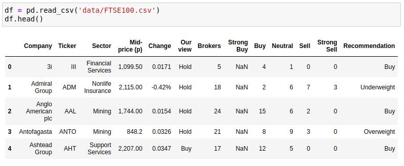
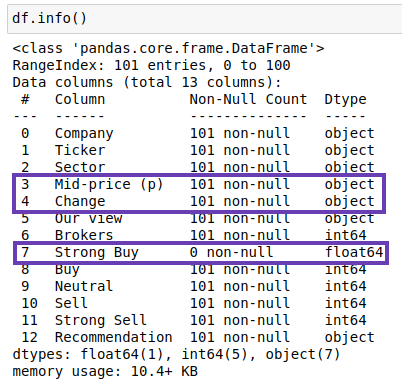
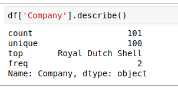

<!-- ## FTSE Market - Data Cleansing  -->

The Financial Times Stock Exchange 100 (FTSE 100) Index data is a share index of the 100 companies listed on the London Stock Exchange with the highest market capitalisation. 

Before we were able to perform any data analysis, some data cleansing was required which was the focus of this project. What do I mean by data cleansing? That is the removal of missing or incorrect values, and superfluous data. Transforming some of the data involved changing data types which allowed me to utilise arithmetic operators to create new columns within the data set before analysis took place.


To begin data cleansing, I first had to import Pandas, this is because I was working with a dataframe. By calling the **.read_csv()** function, I was able to import (or ‘read’) the CSV file into a dataframe and take a look at the dataset. Calling the **.head()** method on the dataframe allowed me to print out the first 5 rows so that I could get an idea of what the dataset looks like:


I then called **.info()** to look at the data types and amount of non-null values in the dataframe:


Upon inspection, I found that one of the columns (‘Strong Buy‘) was made up entirely of null (or NaN) values - I know this because **.info()** told me that this column had 0 non-null values. When I looked more closely at the data types of the columns, I also found that the ‘Mid-price (p)’ and ‘Change’ columns were listed as object types. By looking at the rows I printed out earlier, I could see that these should be float not object types as the values represented currency. I also noticed that there were 101 rows when there should only be 100. This was going to need fixing.

We were told that one of the companies (Royal Dutch Shell) had two entries, but I wanted to know how I could identify this for myself. After reading through Pandas documentation, and some trial and error, I was able to work this out by using **.nunique()** on the dataframe, which showed me that there were 100 company names but 101 ‘Tickers’ (these are abbreviations for the companies). I then used **.describe()** on the ‘Company’ column to find the duplicated company, like this:

 This showed me that  ‘Royal Dutch Shell’ had 2 rows (‘top’ referring to the most common value, and ‘freq’ referring to how often it occurs). I was then able to use the following line of code to compare the 2 entries and decide which to keep: 
```python 
clean_df = df.copy() 
clean_df = clean_df.drop('Strong Buy', axis=1)
clean_df = clean_df.drop(clean_df[clean_df['Ticker'] == 'RDSA'].index) 
``` 


