The Financial Times Stock Exchange 100 (FTSE 100) Index data is a share index of the 100 companies listed on the London Stock Exchange with the highest market capitalisation. 

Before we were able to perform any data analysis, some data cleansing was required which was the focus of this project. What do I mean by data cleansing? That is the removal of missing or incorrect values, and superfluous data. Transforming some of the data involved changing data types which allowed me to utilise arithmetic operators to create new columns within the data set before analysis took place.

### Data Cleansing

To begin data cleansing, I first had to import Pandas, this is because I was working with a dataframe. By calling the **.read_csv()** function, I was able to import (or ‘read’) the CSV file into a dataframe and take a look at the dataset. Calling the **.head()** method on the dataframe allowed me to print out the first 5 rows so that I could get an idea of what the dataset looks like:
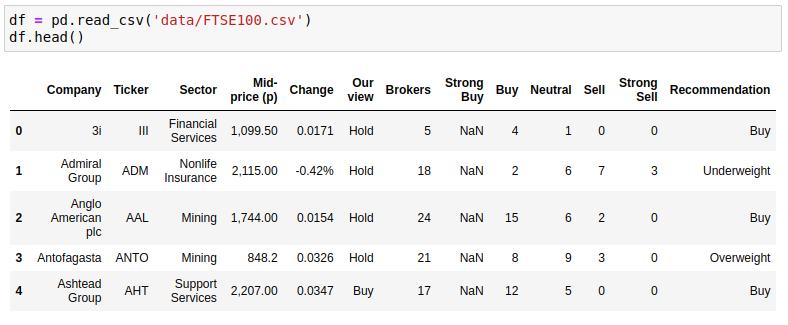

I then called **.info()** to look at the data types and amount of non-null values in the dataframe:
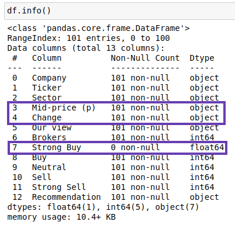

Upon inspection, I found that one of the columns (‘Strong Buy‘) was made up entirely of null (or NaN) values - I know this because **.info()** told me that this column had 0 non-null values. When I looked more closely at the data types of the columns, I also found that the ‘Mid-price (p)’ and ‘Change’ columns were listed as object types. By looking at the rows I printed out earlier, I could see that these should be float not object types as the values represented currency. I also noticed that there were 101 rows when there should only be 100. This was going to need fixing.

We were told that one of the companies (Royal Dutch Shell) had two entries, but I wanted to know how I could identify this for myself. After reading through Pandas documentation, and some trial and error, I was able to work this out by using **.nunique()** on the dataframe, which showed me that there were 100 company names but 101 ‘Tickers’ (these are abbreviations for the companies). I then used **.describe()** on the ‘Company’ column to find the duplicated company, like this:
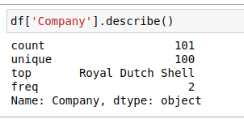 

This showed me that  ‘Royal Dutch Shell’ had 2 rows (‘top’ referring to the most common value, and ‘freq’ referring to how often it occurs). I was then able to use the following line of code to compare the 2 entries and decide which to keep: 
```python 
df[df['Company'] == 'Royal Dutch Shell']
``` 
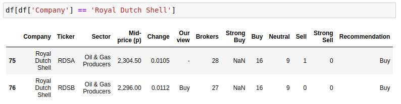

In this instance I was told to keep row 76, upon reflection I would have chosen to keep this row as it had a value for the column ‘Our view’. Through my research I also found an alternative way of dealing with duplicated rows. The Pandas library has a method called **.duplicated()** which allows you to check for duplicates, and if it finds one it will treat the first instance as unique and any subsequent copies as duplicates and remove them for you. However, I prefer the way I did it in the assignment as **.duplicated()** would have removed the row I chose to keep; it also doesn’t allow you to check for differences across the rows.

### Tidy Data

To tidy the data, I made a copy of my dataframe so as not to alter the original, dropped the ‘Strong Buy’ column as it only contained NaN values which didn’t contribute anything to the data, and dropped the duplicate row which I identified through the ‘Ticker’ column:
```python 
clean_df = df.copy() 
clean_df = clean_df.drop('Strong Buy', axis=1)
clean_df = clean_df.drop(clean_df[clean_df['Ticker'] == 'RDSA'].index) 
``` 
I checked this had worked by running **clean_df.head()** to ensure the ‘Strong Buy’ column was gone, and **clean_df.info()** to check that all columns now had 100 rows, which they did.

### Change Column Data Type

Next I created some functions (**convert_to_float** and **format_change**) to convert string data types into float data types as some of my columns had the wrong data type (‘**Mid-price (p)**’ and **‘Change’** were both string types). 

Firstly, I created a function that would take the parameter of a string (I called this ‘x’), then I would test the code for errors using **'try'** - here I checked for commas in the string values and if they were present, replaced them with nothing, thereby removing them. Next, I used **'except'** to deal with errors by turning them into NaN (not a number) values. By calling **.apply()**, I was able to pass each of the values in the series **price_df['Mid-price (p)']** to the function **convert_to_float** as the argument x.

```python 
def convert_to_float(x):
    try: 
        return float(x.replace(',', '')) 
    except:
        return np.nan 
``` 
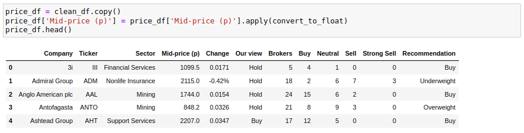

### Format Change Values

The second function needed to remove the **%** symbol from negative values, multiply positive numbers by 100, and convert the values into floats. Firstly, I defined the function and gave it the name **format_change** and a string parameter (called ‘x’). I then added an if statement to check whether the last index of my string was **%**, and if it was, to remove it by replacing it with nothing. After this, I cast the string to a float and then created another if statement to check whether its value was positive, logically if it is equal to or greater than zero (>= 0). If the value was positive it would be multiplied by 100.
```python 
def format_change(x):
    if x[-1] == '%': 
        x = x.replace('%', '') 
    x = float(x)
    if x >= 0:
        x = x * 100
    return x
``` 
I then tested out the function and found that it worked:
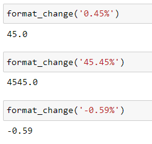

In this instance I wanted to use the function to create a new column rather than changing the values of the original column, so I did the following:
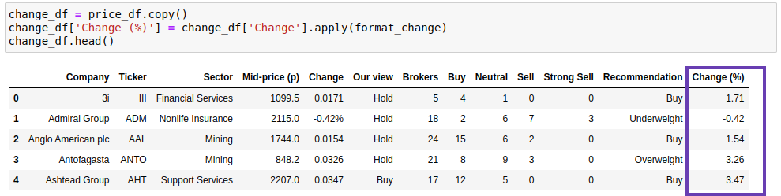

Again I used the **.apply()** method to call my function **format_change()**.
In both instances I ran **price_df.head()** and **price_df.info()** to check it had worked.

### Holding Summary

Next I created a dictionary to calculate some holding information for me using the following code as my basis:
```python 
holding = ('BP.', 500, 1535.21)

print(holding[0])  #ticker code
print(holding[1])  #number of shares
print(holding[2])  #price paid 
```
In order to create this dictionary I first had to define my values and assigned them to variables; 
  - **holding_cost** = number of shares * price paid, converted into £ (the original data used pence)
  - **holding_value** = number of shares * current mid-price, converted into £ - to help me calculate this variable, I wrote the following line of code to find the row number that matched the ticker code from my **holding** tuple, and assigned it to a variable called **row_number**. 
    ```python 
    row_number = change_df.index.get_loc(change_df[change_df['Ticker'] == holding[0]].index[0])
    ```
  - **change_in_value**; for this variable I wanted to calculate the percentage change from the original cost (price paid) to the current cost (mid-price). In order to do this, I first worked out the difference between **holding_value** and **holding_cost** and assigned it to the variable **change**. I then used that variable to work out the **change_in_value** ((change / holding_cost) *100)

```python 
holding_cost = (holding[1] * holding[2])/100 
holding_value = (holding[1] * change_df['Mid-price (p)'].values[row_number]) / 100 
change = (holding_value - holding_cost) 
change_in_value = (change / holding_cost) *100
```

I then created my dictionary, **holding_dict**, by assigning the following key-value pairs to holding_dict; 
```python 
holding_dict = {
    'holding_cost': holding_cost,
    'holding_value': holding_value,
    'change_in_value': change_in_value    
}
```
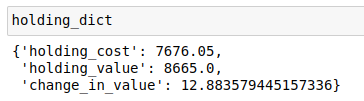

### Market Comparison

I wanted to compare the *percentage change in the mid-price* for each company to the a*verage percentage change* for all companies in the market, and provide a summary of the broker recommendations.

To start with I created a copy of my dataframe again, so as not to alter the original data.
```python
comparison_df = change_df.copy()
```
I then created a variable to work out the average market change:
```python 
ave_market_change = comparison_df['Change (%)'].mean()
```

Using my new variable, **ave_market_change** (a series), I was able to create my new columns in my dataframe, **comparison_df**:
  - 'Beat Market' - The values of this column to be boolean representations of whether or not 'Change (%)' exceeded the average market change.
  - ‘Buy Ratio’ - The values of this column to be float representations of the ratio between the ‘Buy’ and ‘Brocker’ columns.
```python 
comparison_df['Beat Market'] = comparison_df['Change (%)'] > ave_market_change
comparison_df['Buy Ratio'] = comparison_df['Buy'] / comparison_df['Brokers']
```

I followed this by running **comparison_df.head()** to check my new columns were successfully created:
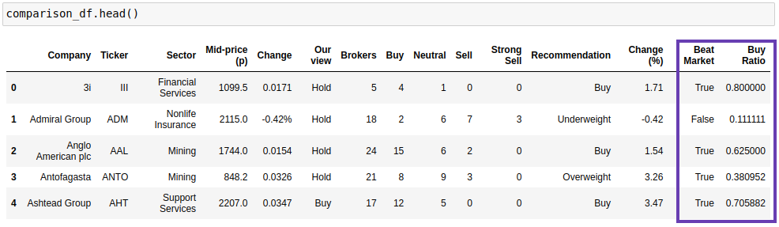

### Investigate

Starting with a **watchlist** of some companies of interest, we were asked to determine which companies in the list had prices that were equal to, or less than the given target price, or have a Buy Ratio value equal to, or higher than 0.5. If one or both of these conditions were true, the name of the company would be added to a list called **companies_list**.
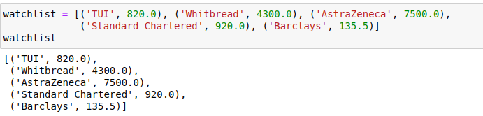

To start with, I created an empty list and called it **companies_list**. I then started a **for** loop to iterate through **watchlist** (my list of company tuples), assign the first value in each tuple (i.e. the company name) to a variable called company_name, and the second value (i.e. the target price) to a variable called **target_price**.

```python
companies_list = [] 
for comp in watchlist:
    company_name = comp[0] 
    target_price = comp[1]
```

From here, I created a variable called **row** to help me find the row in the database that contains my **company_name** - here I found that I could use the following line of code to find the full row (i.e. with all the column values for that company), or simply the row number (or index) by adding **.index[0]** onto my line of code:
```python
row = comparison_df.loc[comparison_df['Company'] == company_name] 
```
I stuck to the former as **.index[0]** wasn’t compatible with the rest of my code (it created an index error: *‘invalid index to scalar variable’*), whereas row, as a dataframe, was compatible. 

I then needed to access the mid price and buy ratio values from the dataframe that corresponded with the **company_name** value, so created 2 new variables for this purpose; 
```python
    mid_price_val = row['Mid-price (p)'].values[0] 
```
  - In this variable used Pandas to look at the 'Mid-price (p)' column in the dataframe row and get its value and assign it to my variable.
```python
buy_ratio_val = row['Buy Ratio'].values[0]
```
  - Similarly, here I was interested in the row (or index) value of the column 'Buy Ratio' .

Finally , I created 2 **if** statements; one to test whether the mid price value was less than or equal to the target price, and a second to test whether the buy ratio value was equal to or greater than 0.5. 

```python 
    if mid_price_val <= target_price: 
        companies_list.append(company_name)
    
    if buy_ratio_val >= 0.5:
        companies_list.append(company_name)
```
In both instances if the test was true, the company name (taken from the **company_name** variable) was to be added to the blank list I created at the start, **companies_list** - this was done by using the **.append()** method. 

Lastly, I cast **companies_list** to a set data type to get rid of duplicates as some companies met both criteria and I only wanted them to appear in my list once, and then to a list as that was the data type I wanted to return.
```python 
companies_list = list(set(companies_list))
```
Once I ran my code, I found that 3 of the companies in **watchlist** had prices that were equal to or lower than the target price, had a Buy Ratio value equal to or higher than 0.5, or both. These companies were Standard Chartered, TUI, and AstraZeneca.
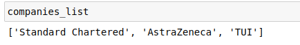

### Aftermath - What did I learn?

By completing this assignment I gained a better understanding of the importance of data cleansing and why it is often necessary.
Data cleansing allows you to investigate the data set you are interested in, and get it ready for your project. Often times you may find that columns contain NaN values or duplicates, or might be in the wrong data type. Things like this can interfere with your analysis, by either returning the wrong calculations or by causing an error and not returning a result. Data cleansing is, therefore, an absolute requirement to be able to effectively work with the data.

By doing this you may also find that certain columns are less valuable/important to you and may choose to drop them from your dataframe - though you should always make sure to use the **.copy()** method to create a copy of the original dataframe. You might not want that column, but someone else using the dataframe might!

During this particular assignment, I had to deal with a column made up entirely of NaN values, a duplicated row, as well as values with the wrong data type and including unwanted characters (commas and percentage symbols). However, I was also able to create some new columns, make use of the **.apply()** method to pass the values of a series into a function, and prepare my dataframe for further analysis.

