In this project, I will delve into an analysis of book sales using a comprehensive dataset sourced from Kaggle: https://www.kaggle.com/datasets/thedevastator/books-sales-and-ratings/data

Exploring book sales provides a wealth of information about cultural trends, consumer preferences, and market dynamics. Book sales data can reveal which genres, topics, and authors are currently resonating with readers, helping publishers, authors, and marketers make informed decisions. Additionally, analysing sales trends can highlight shifts in reading habits, the impact of pricing strategies, and the effectiveness of promotional efforts. Understanding these patterns not only helps stakeholders in the publishing industry, but also offers a glimpse into broader societal interests and changes in public discourse. 

This dataset includes several variables that provide insights into book sales, ratings, and genres; my analysis will involve a thorough cleaning and exploration of this data.

## Understanding the Dataset
The dataset contains the following columns:
- **Publishing Year**: The year the book was published.
- **Book Name**: Title of the book.
- **Author**: Name of the author.
- **Language Code**: Code representing the language of the book.
- **Author Rating**: Rating of the author based on their previous works.
- **Book Average Rating**: Average rating given by readers.
- **Book Ratings Count**: Number of ratings given by readers.
- **Genre**: Genre of the book (fiction, non-fiction, children).
- **Gross Sales**: Total sales revenue generated.
- **Publisher Revenue**: Revenue earned by the publisher.
- **Sale Price**: Price at which the book was sold.
- **Sales Rank**: Rank of the book based on its sales performance.
- **Units Sold**: Number of units sold.

## Data Cleaning and Preparation
To begin with, I imported some libraries, including *Pandas*, to allow me to read my csv file and to help with the cleaning and analysis.

```python
import pandas as pd
import numpy as np
from matplotlib import pyplot as plt
import seaborn as sns
```

Here are the top 5 rows of the raw dataset after calling **.read_csv()**:

")
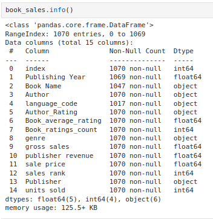

I examine the top five rows and the output from *.info()* to get an understanding of the data structure and to help me decide which columns were relevant to keep. 

To refine my analysis, I used the **.unique()** method on several columns to identify values that were irrelevant. This led me to drop the following columns:
*index*: Duplicate information already present in the dataset.
*language_code*: Not necessary for our analysis.

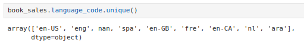
*sales rank*: Similar information could be inferred from *units sold*.

Additionally, after reviewing the *Author_Rating* column, it became clear that the ratings were not a good indicator for the book's performance in my context. For instance, Harper Lee, a renowned author, was rated as a "novice," which I found problematic as “To Kill a Mockingbird” is a classic that is often taught in school. Additionally, the values of the column felt too arbitrary for me nor did they feel relevant to this project - I would have preferred to look at number of books written and published. So *Author_Rating* was dropped as well.

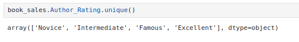

I then used the following piece of code to clean my dataset:
```python
book_sales_clean = book_sales.copy().drop(columns=['index', 'language_code', 'sales rank','Author_Rating']) #drop columns
book_sales_clean.rename(columns={'Publisher ': 'publisher', 'publisher revenue':'publisher_revenue'}, inplace=True) #get rid of white space in publisher
```

This was followed by calling **.info()** to look at the data structure and to look for NaNs etc.

After this I used the **.isna()** and **.dropna()** methods to deal with NaNs, as well as the **.astype()** method to convert *Publishing Year* into int.

```python
book_sales_clean[book_sales_clean['Publishing Year'].isna()] #check for nans in publishing year column

book_sales_clean.dropna(subset=['Book Name', 'Publishing Year'], inplace=True)  # if rows have nans in book name or pub year columns, drop them

book_sales_clean['Publishing Year'] = book_sales_clean['Publishing Year'].astype(int) #convert column to int
```

## Data Analysis & Visualisation

By utilising the **.describe()** method I was able to look atthe desciptive statistics of my numerical columns.

```python
book_sales_clean[['Book_average_rating', 'Book_ratings_count', 'gross sales', 'publisher_revenue', 'sale price', 'units sold']].describe()
```

This showed that:
- the average book rating was around 4.0
- the average publisher revenue was 833.9
- the average gross sales was 1847.2

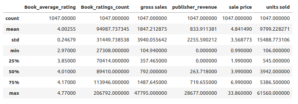

Visualisation is a powerful tool for understanding patterns and trends in data. Here are some of the visualisations I used to analyse book sales:

1. **Publisher Distribution**: To understand the distribution of publishers, I  created a pie chart. 

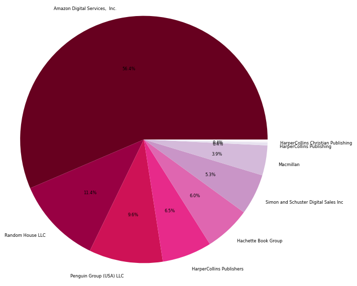

This pie chart shows that 56.8% of the publishers in this dataset (of 1047 books) where from Amazon Digital Services, which shows how popular / influencial they are in the publishing industry.


2. **Gross Book Sales by Publishers**: This visualisation gives a clear picture of which publishers have the highest gross sales and is differentiated by the genres of *fiction, non-fiction, and children*.

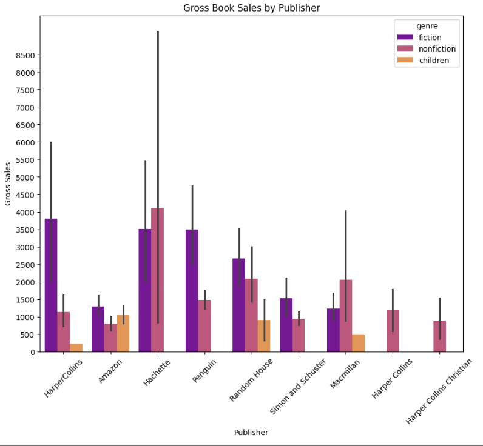

It shows that fiction books tend to have the highest gross sales across publishers, with the highest gross sales for fiction books coming from *Harper Collins*, followed closely by *Hachette* and *Penguin*. Meanwhile, 'Hachette' is the leading publisher in terms of gross sales within non-fiction. This plot also shows that there is a lot of variability in the data, particularly for the 'non-fiction' values of *Hachette*. Clearly if you want to publish a fiction book, the best choice of publisher would be *Harper Collins*, *Hachette*, or *Penguin*, whilst for non-fiction, *Hachette* seems to be the best choice.


3. **Relationship Between Gross Book Sales and Publishing Year**: To explore the relationship between gross sales and publishing year, I created a scatter plot. 

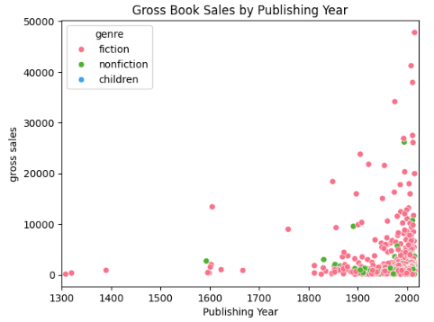

This shows that there has been a massive increase in books being published since the 20th century, the majority of which being fiction.

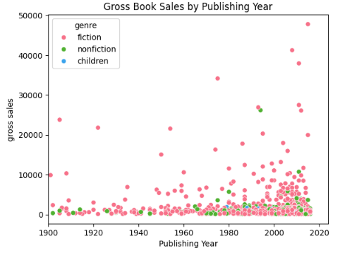

When you look more closly at the data, you see that 


This provides insights into how pricing might affect sales volume.


4. **Joint Plot of Average Ratings and Units Sold**: A joint plot was generated to examine the relationship between a book's average rating and the number of units sold. This helped us understand whether higher-rated books tended to sell more copies.

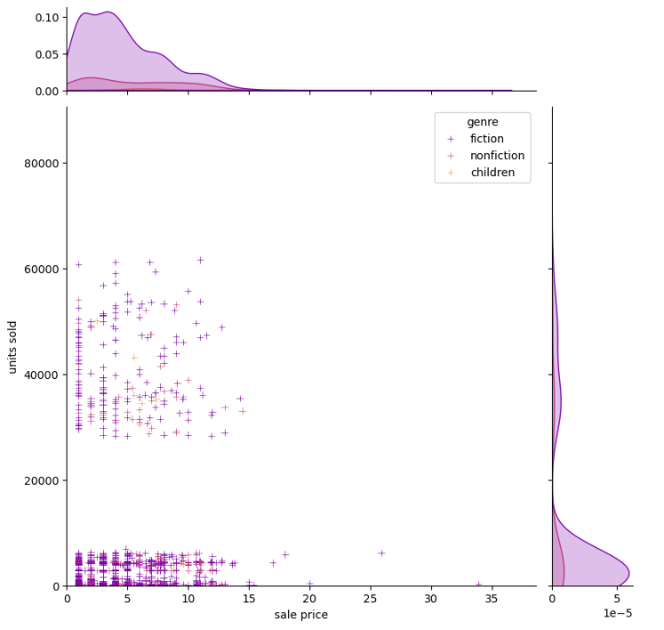
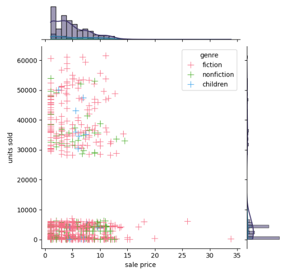

This shows


5. **Distribution of Units Sold**: Using a histogram, I was able to visualise the distribution of the number of units sold across different books, highlighting any skewness in sales.

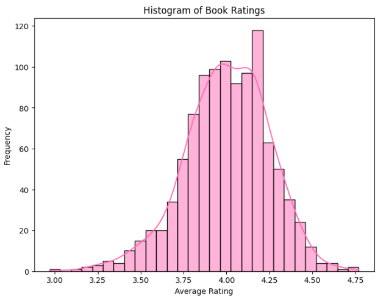

This shows


6. **Heatmap of Correlations**: Using a heatmap, I was able to identify any correlations between different numerical variables in the dataset, such as gross sales, publisher_revenue, units sold, and sale price.

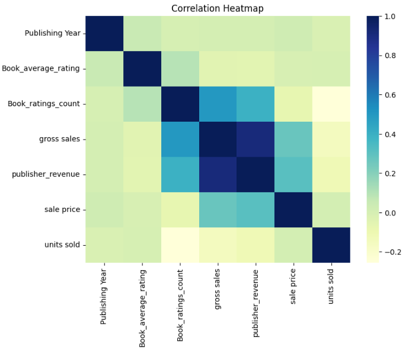

This shows


## Conclusion

This analysis of book sales has provided valuable insights into the publishing industry, helping us understand key factors that influence book sales and trends. From the significance of book ratings and genres to the role of pricing strategies and publisher revenues, these visualisations allow us to see the bigger picture of the book market
