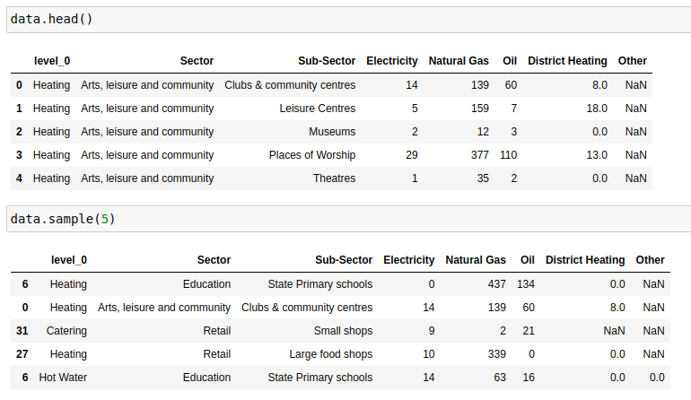
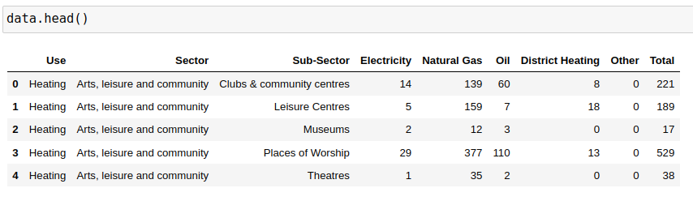
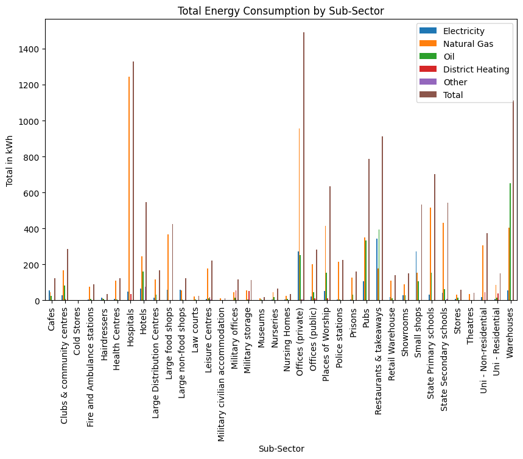

This assignment focused on datasets from the UK government from 2018, detailing energy consumption across various sectors of industry (Heating, Hot Water, Catering). Each dataset had 36 rows (or indexes) and 5 to 7 columns:


The energy types being looked at were Electricity, Natural Gas, Oil, Distric Heating, and Other (measured in kWh). 

Within this assignment I wanted to visually summarise and present the results of my data analysis using a variety of graphs and charts. In order to do this, I used the Matplotlib Python library. Data visualisations are an important part of data analysis, particularly for a business as it allows you to professionally present the data and your findings that you can make recommendations as to how to improve the business. In this case, my findings revealed which sector used the most energy as well as the most used types of energy. With this knowledge I can recommend which sectors should try to incorporate more green energy, or at least put measures in place to reduce the amount of certain types of energy they use (e.g. natural gas).

### Importing Libraries
I first needed to import some python libraries; **Pandas** and **Matplotlib** (more specifically, pyplot so that I could create some charts):
```python
import pandas as pd
from matplotlib import pyplot as plt
```
I also added the following code which sets the logging level to 'ERROR', meaning that only errors and critical messages will be logged and I won't receive debug, info, or warning log messages. 

```python
from matplotlib.axes._axes import _log as matplotlib_axes_logger
matplotlib_axes_logger.setLevel('ERROR')
```

### Data Collection
Using the following code, I was able to combine some CSV files into one dataframe (called data) using the **.concat()** method. I did this so that I could process the data from 3 datasets (heating_2018, hot_water_2018, and catering_2018) all at once and carry out some analysis. This resulted in a dataframe shape of 108 indexes and 8 columns.
```python
df1 = pd.read_csv('data/heating_2018.csv')
df2 = pd.read_csv('data/hot_water_2018.csv')
df3 = pd.read_csv('data/catering_2018.csv')
data = pd.concat([df1, df2, df3], keys=['Heating', 'Hot Water', 'Catering']).reset_index(level=[0])
```
I assigned a key to each file to help differentiate between them (this generated a new column called *level_0* in which the values would be the corresponding key for the data) and reset the index using **reset_index(level=[0])** so that the new dataframe would start at index 0. This would mean that each row would have a unique index number. 
Concatenating dataframes would usually result in a *index* column of the original index values, however, as I used the **keys** parameter of **.concat()**, this will also generate an index column - this will result in 2 columns, *level_0* and *level_1*. This is why I have added **level=[0]** when **reset_index()** is called. This allowed me to drop level_1 which was no longer needed as a new index (starting at 0) had been set. 

The resulting dataframe looked like this - I have included the top 5 rows (.head()) as well as 5 random rows (.sample(5)) - this is because, whilst the top 5 rows show that my code worked, **.sample()** shows that my keys (['Heating', 'Hot Water', 'Catering']) are working as intended:


### Data Processing
Next, I tidied up the data.
Having run the **.info()** method, I could see that some of the columns had NaN values, 2 columns had float data types (I wanted these to be integers), and I didn't like the name of my first column (*level_0*).

I used the **.rename()** method to change the column name using the following code, including *inplace = True* so as to apply the column name change to my current dataframe (if I didn't include it, a new dataframe would have been created with the change, leaving the original unchanged):
```python
data.rename(columns = {'level_0':'Use'}, inplace = True)
```

Next, I used the methods **.fillna()** and **.astype()** to replace my NaNs and floats with more appropriate values. To do this, I first created a list of all the columns that should be integers, but are not ('District Heating', 'Other'), and called that list **numerical_columns**. I then selected these columns from the dataframe using my list and called the **.fillna()** method on the series, setting any NaNs to 0. On top of that, I called the method **.astype()** and cast the values to integers.

```python
numerical_columns = ['Electricity', 'Natural Gas', 'Oil', 'District Heating', 'Other'] 
data[numerical_columns] = data[numerical_columns].fillna(0).astype(int) 
```
After this, I created a new column that calculated the sum of the numerical values of each row (the values for columns 'Electricity', 'Natural Gas', 'Oil', 'District Heating', and 'Other') and called it **'Total'**.

```python
data['Total'] = data.sum(axis=1)
```
I then checked how my dataframe was looking:


As you can see, the NaNs have been changed into 0's and a new column has been creating which sums up the integers for each row. If I run **data.info()**, you will also see that the columns 'Electricity' and 'Natural Gas' are now integers:


### Data Grouping
Next, I wanted to group my dataframe by the sub-sectors so that I could filter the energy type by sub-sector - I did this by calling the **groupby.()** method and passing the *'Sub-Sector'* column. By using **.sum()** I was also able to calculate the total of the numerical columns of each group. 

```python
ss = data.groupby(by = 'Sub-Sector').sum()
ss.sample(5)
```
This resulted in the following dataframe:


I was then able to create a bar plot for a nice to visualisation of the total sum of numerical values for each sub-sector which shows that hospitals consume the most energy (i.e. natural gas), whilst private offices consume the most energy across all energy types:


I also wanted to calculate the energy types by the *'Use'* column to get an idea of how much of each energy type was being consumed by catering, heating, and hot water industries. To do this I again used the methods **groupby.()** and **.sum()**.
```python
use = data.groupby(by = 'Use').sum() 
use
```

This showed that 'Heating' used by far the most energy. Though interestingly, 'Hot Water' was the only user of 'Other energy'.

This pie chart offers a nice visual for this, clearly showing that Heating consumes the most energy:


I also used the **.agg()** method to allow me to apply some functions onto a **.groupby(by=Sector)** so that I could produce some extra stats on top of the data by sector:
```python
sector = data.groupby(by = 'Sector')['Total'].agg(['sum', 'mean', 'count'])
sector = sector.sort_values(by = 'sum', ascending = False)
```
This showed me the sum, mean, and count for all the values, arranged by the sectors.

<!--  -->
<!--a summary of what you can see from this data about sample sizes or clear outliers like the military.  -->
<!--  -->

### Data Visualisation
Next, I wanted to create some more data visualisations for each type of energy. 

I first created a histogram to show how the values in the 'Electricity' column were distributed. This showed that most of the values were concentrated between 0-55 kWh.


Alternatively, I could have used a scatter plot to compare 2 columns, for example, 'Total' vs 'Natural Gas':

Again, this shows the data distribution, but this time the outliers are easier to spot.

Next I created a bar plot to show energy consumption by the sectors:

This revealed that biggest consumer of energy was the hospitality sector, whilst the smallest consumer was the military.

Finally, I wanted to show the energy consumption by industry ('Use') excluding the 'Total' column. For this, I created a new dataframe and used the **.loc[]** function to carry out some label indexing:
```python
new_df_use = use.loc[:, ['Electricity', 'Natural Gas', 'Oil', 'District Heating', 'Other']]
```
This allowed me to create the following dataframe: 


Using this dataframe I was able to create the following horizontal and stacked bar plot:

This shows the energy consumption by industry, but also breaks it down by the specific energy type. This allows you to see not only which industry consumes the most energy, but which energy type they use most.

<!-- scatter plot  to check if any one record is skewing the data-->

### Aftermath - What did I learn?
This assignment taught me how to combine multiple datasets using **.concat()**, allowing me to compare and analyse 3 datasets at once. The importance of data cleansing was also reinforced as I had to tidy up the dataframe; I had to use **.fillna()** to convert NaN values into 0, **.astype(int)** to cast some floats to integers, **.rename()** to change the name of a column, and **.reset_index()** so that the new dataframe would have an index beginning at 0. All of this massively improved the readability of the dataframe. 

Something else I learnt whilst completing this assignment was that there are several log levels (notset, Debug, Info, Warning, Error, & Critical) which applications give off to indicate that they are working, have a bug, etc. However, in some instances you might want to stop some of those log messages from appearing, for example, within this project I set the logging level to 'ERROR' as I only wanted to be notified if there was an error or something critical. 

I also learnt how to create a variety of graphs/charts using Matplotlib, for example, Histograms to visualise the distribution of continuous data, Scatter plots to identify correlations between two variables, and bar charts to compare categorical variables. I also learnt some of the ways in which I can customise/modify plots with the use of Matplotlib's extensive options, e.g. **plt.ylim()/plt.xlim()** to set the range of my axes, **figsize=()** to change the size of the plot, or **colors=[]** to change the plot's colours.
