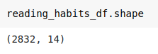
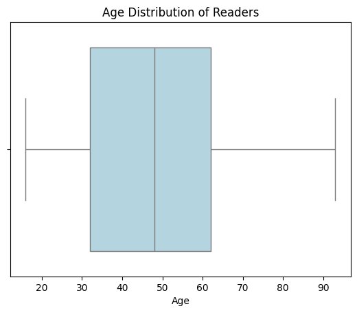
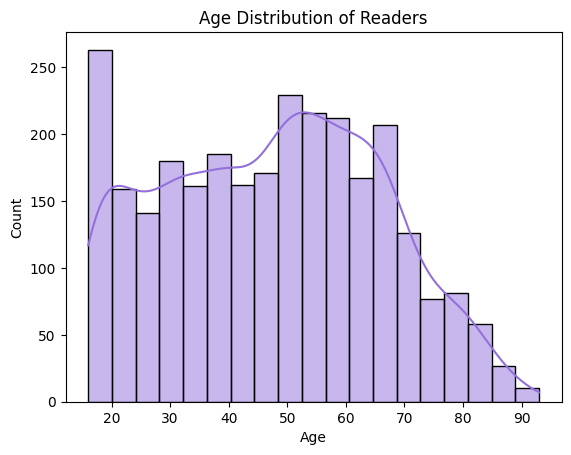
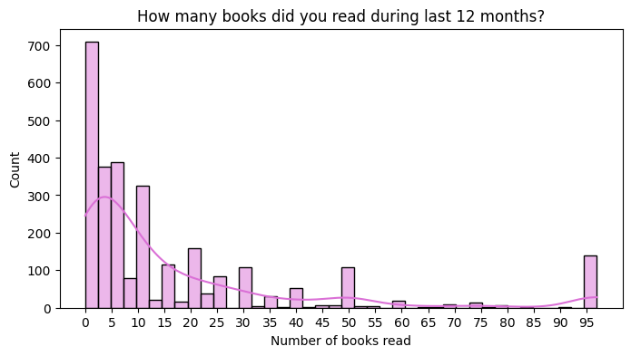
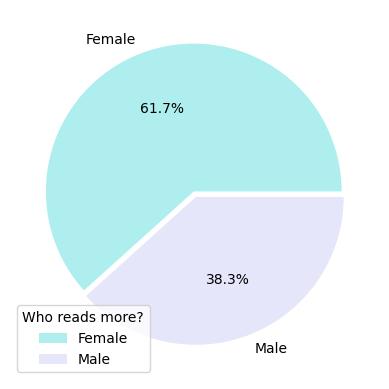
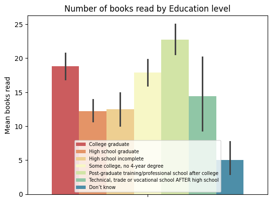
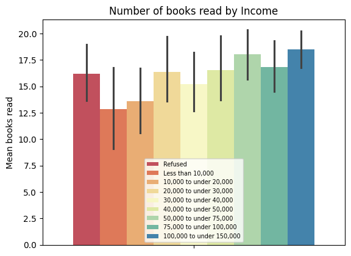
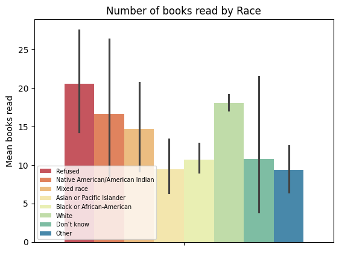
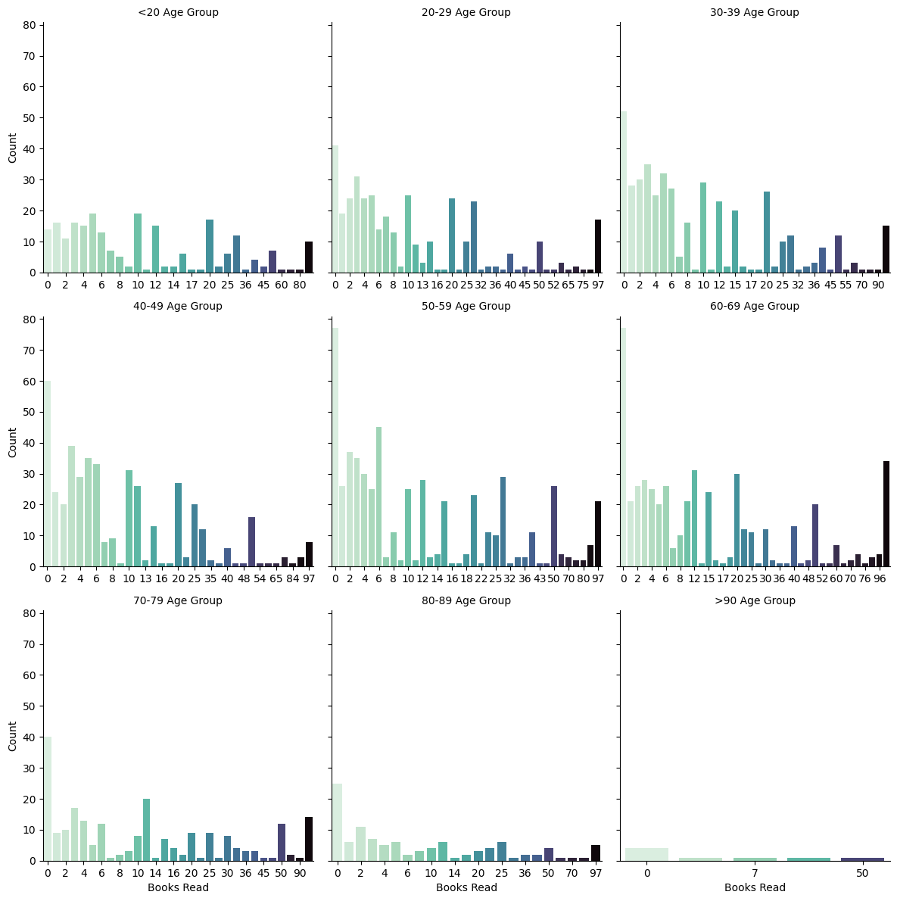

As an avid reader with an interest in social trends and data visualisation, for this project I wanted to explore reading habits across demographics such as gender, age, and race.

I wanted to explore a dataset that would help me answer the following questions:
1. Do females read more than males? 
2. Do gender, age, education, income, or race influence how much a person reads?

### Data Collecting
I used the following dataset from kaggle.com:
- **Reading habits**: https://www.kaggle.com/datasets/vipulgote4/reading-habit-dataset/data 

This dataset looks at the reading habits and demographics of 2832 people, across 14 columns. It includes age, gender, and number of books read in a 12 moth period (the data is about 4 years old).

")


### Importing Libraries
After I found the dataset I wanted to use, I imported some python libraries to help with my analysis and visualisations; **Pandas**, **NumPy**, **Matplotlib**, and **Seaborn**:
```python
import pandas as pd
import numpy as np
from matplotlib import pyplot as plt
import seaborn as sns
```
I was then able to use the **.read_csv()** method to read my dataset into a DataFrame. After this, I explored the dataset, checked if anything needed to be amended or removed, looked for NaNs, and got to cleaning.  

#### Data Cleaning
With this dataset I was happy with the data types of the columns, but I decided to drop the last 3 columns as I wasn't interested in them. I did this by first creating a copy of my DataFrame to allow me to track my changes, created a list of the columns I wanted to drop (I called this list *cols_to_drop*); by creating a list of the columns I wanted to alter, I was able to pass the list name through a method rather than naming each column, which in this case would have been a long and messy piece of code due to the column names being so long.
I then used the **.drop()** method, passing my list of columns as the parameter.
```python
cols_to_drop = ['Last book you read, you…',	'Do you happen to read any daily news or newspapers?',	'Do you happen to read any magazines or journals?']

clean_df = reading_habits_df.copy()
clean_df = clean_df.drop(cols_to_drop, axis=1)
```
I debated keeping the 'Last book you read, you…' column, which outputs the following values:
 / .value_counts()") 

But after utilising the **.unique()** (to return all the unique values, including NaNs) and **.value_counts()** (to return the count of all unique values, excluding any NaNs) methods, it didn't make sense to include this in my analysis as it wasn't clear what some of the values represented ('8' and '9') and changing them into 'unknown' wouldn't contribute any value to the data. I also decided that I was more interested in how many books people read in a year and whether they were physical books, ebooks, or audiobooks - though I wish the data included how many books where of each format.

Next I used the **.fillna()** method to changed some NaNs into "Don’t know"; I chose this as the columns already had "Don’t know" as a value. Again I created a list of columns (this time of the ones with NaNs I wanted to convert to "Don’t know") and called it *nan_cols*. 
```python
nan_cols = ['Education', 'Read any printed books during last 12months?', 'Read any audiobooks during last 12months?', 'Read any e-books during last 12months?']
clean_df[nan_cols] = clean_df[nan_cols].fillna('Don’t know')
```

During my initial exploration, I also found that one of the columns had a typo in some of the values. The **.value_counts()** method revealed that 212 values in the *'Incomes'* column were equivalent to *9$100,000 to under $150,000* which clearly was a typo. 

 ") 

To combat this, I called the **.replace()** method to allow me to fix this typo by removing the '9' at the start:
```python
reading_habits_clean = clean_df.copy() #tracking changes
reading_habits_clean['Incomes'] = reading_habits_clean['Incomes'].replace('9$100,000 to under $150,000', '$100,000 to under $150,000')
```
I also applied the following function onto the column to fix the formatting as the values were being squished which made them difficult to read; I did this by removing the '$' sign.

```python
def fix_format(x):
  if '$' in x:
    return x.replace('$','')
  else:
    return x

reading_habits_clean['Incomes'] = reading_habits_clean['Incomes'].apply(fix_format)
```

Finally, I needed to rename one of the columns as it was misspelt ('Employement'). I did this with the following piece of code.
```python
reading_habits_clean = reading_habits_clean.rename(columns={'Employement':'Employment'})
```

My resulting clean DataFrame looked like this:
") 

#### Age Distribution
I decided to create a boxplot next to allow me to see the central tendency, dispersion, and outliers within age. This showed that the majority of the sample were aged between 30-60 years, with some outliers on both ends. 

 

By calling the **.describe()** method, I was able to see that the youngest person was 16 years old and the oldest was 93 years old, with the average age being 47.3 years old, whilst the mode age was 50 years old.  

A histogram showed that a large amount of the sample were in their 20s, though the majority of people aged between 50-60 years old. And though it looks like there were many twenty-something year olds, 20-29 year olds only made up 13% of the group, whilst 50-60 year olds made up 21.6%.

 

I also used a histogram to look at the distribution of the number of books read over a 12 month period, based on ages. 
 

From this histogram I can see that the data is skewed to the left, i.e. most people read around 0-15 books.
Running some descriptive statistics (by calling the **.describe()** and **.mode()** methods) showed that the average books read (i.e. the mean) were 16.7, though a large reason for this might be that the highest count seemed to be for 0-2 books (i.e. around 700 people said they read 0 to 2 books). This is also supported by the mode being 0.

") 

By running the following line of code I was able to work out that 390 people said they didn't read any books (i.e. 13.8% of the people in the dataset).
```python
none_read = len(reading_habits_clean[reading_habits_clean['How many books did you read during last 12months?']==0])
none_read
```

The histogram also showed several outliers, for example, around 100 people said they read 90-95 books. In fact, 141 people said they read 90+ books:
```python
high_readers = len(reading_habits_clean[reading_habits_clean['How many books did you read during last 12months?']>=90])
high_readers
```
### 1. Do females read more than males?

I then used a countplot which supported the theory that females read more than males - interestingly, it also showed that nearly twice as many males read 0-2 books in the 12 months leading up to the data collection, than females.  
 

And lastly, the pie chart below shows that, of all the books read (according to the 'How many books did you read during last 12months?' column), 61.7% of them were read by females. 

 

### 2. Do gender, age, education, income, or race influence how much a person reads?

Next I wanted to compare the number of books read with level of education, income, marital status, race, and age. I did this by creating several bar graphs looking at the mean books read. 

The following bar plot shows that post-grade educated people read the most (around 22 books), followed by college graduates (~18 books) and people with 'some college' - it would have been interesting to see what type of books these individuals read but unfortunately, this dataset didn't specify that information. Excluding the group that refused to disclose their educational level who collectively read the least,  the rest read a similar amount (between 10-14 books). This suggests that higher educated people read slightly more but the average person isn't far off. Though there was some variability in number of books read across each category as shown by the error bars.

 

When looking at income brackets, I found that there wasn't too much difference in number of books read. The bar graph below shows that those earning between $100,000 - $150,000 read the most (around 18 books), however, the least read books was around 12.5 (those earning the least).

 

Interesting, the following bar graph revealed that individuals who were 'separated' read the fewest books (~10), whereas those 'living with a partner' read the most (a little under 20 books) and also showed the greatest variability in the number of books read. 

 

When Comparing number of books read by race, I found that those identifying as 'white' read the most (~18 books), and those identifying as 'Asian or Pacific Islander' read the least(~10 books). However, those who read the most (~20 books) didn't disclose their race, and similarly some people said they "didn't know" their race or selected 'other'. Interestingly, there was also a lot of variability across each race. 

 

In order to explore the correlation between age and books read, I first created a new column (*age_group*) and grouped the ages by decade to make it more manageable to handle. I did this using the following code:
```python 
age_df = reading_habits_clean.copy() #tracking changes

age_df.loc[age_df['Age']<20, 'age_group'] = '<20'
age_df.loc[age_df['Age'].between(20,29), 'age_group'] = '20-29'
age_df.loc[age_df['Age'].between(30,39), 'age_group'] = '30-39'
age_df.loc[age_df['Age'].between(40,49), 'age_group'] = '40-49'
age_df.loc[age_df['Age'].between(50,59), 'age_group'] = '50-59'
age_df.loc[age_df['Age'].between(60,69), 'age_group'] = '60-69'
age_df.loc[age_df['Age'].between(70,79), 'age_group'] = '70-79'
age_df.loc[age_df['Age'].between(80,89), 'age_group'] = '80-89'
age_df.loc[age_df['Age']>=90, 'age_group'] = '>90'
```
This produced a DataFrame that looked like this (I have used the **.sample(5)** method to show 5 random rows as I find that it gives a better representation of the data rather than always looking at the same 5 rows).

I then also set the order (I needed to do this as the data type of my new column was string and not ordered) for the *age_group* values by;
1. defining my desired order:
```python
ordered_ages = ['<20', '20-29', '30-39', '40-49', '50-59', '60-69', '70-79', '80-89', '>90']
```
2. Converting my age groups list into an ordered categorical type:
```python
age_df['age_group'] = pd.Categorical(age_df['age_group'], categories=ordered_ages, ordered=True)
```
3. Sorting the DataFrame by my now ordered age_group column:
```python
age_df = age_df.sort_values('age_group')
```

As a result, I was able to produce the following countplots using Seaborn's **FacetGrid** feature.

 

This shows the distribution of the number of books read (0-97 books) in a 12 month period across different age groups. It highlights that people over 70 years old read the least, whilst the most books were read by 60-69 year olds (they had the highest count for 97 books read).
Apart from the youngest age group (<20 years old), most people didn't read any books, as shown by the lightest bar on the left of each plot. This is particularly evident among those aged 50-69 years, where the count for zero books read was around 80 (meaning nearly 80 people within those age groups said they didn't read any books). <!-- 80 by itself means nothing this should be given as a percentage of the whole set -->

Overall, most people, regardless of age, tend to read about 0-10 books, but there is considerable variability and many people read as many as 25-50 books.

### Conclusions
- Most people read between 0-10 books a year (though some people read as many as 97 books!)

- Women reads more than men

- Higher educated people read more than lower educated people 
- Those earning between $50,000 - $150,000 read more than lower earners 
- People that have been widow read the most, whilst those that are separated from a partner read the least
- People who identify as ‘white’ read the most, whilst those that identify as 'Asian or Pacific Islander' read the least
- People aged over 70 years read the least, whilst 40-60 year olds seem to read the most.

   

### Aftermath - What did I learn?
Through this project I was able to explore something I'm passionate about, books. 
This was also my first experience planning and designing a data analysis project all by myself. Part of that included finding a dataset. For this I used kaggle.com which I found to be a great resource for data.

This project not only showed me how challenging finding a dataset to work with is, but also just how much work can go into preparing the dataset for analysis (often A LOT of cleaning). I also learnt how important note taking is when working on a complex project like this, especially if you are working on it for several days, as it's easy to forget what was done the previous day.

I also learnt about Seaborn's **FacetGrid** feature which allowed me to create a multi-plot grid, using countplots to show a visualisation of the relationships between number of books read and several age groups side by side for easy comparison. 

Unfortunately, my dataset lacked some of the information I wanted to explore (I wanted to compare the popularity of fiction versus non-fiction books by gender, as well as which reading format was most popular), but these are things I can always look into later.
