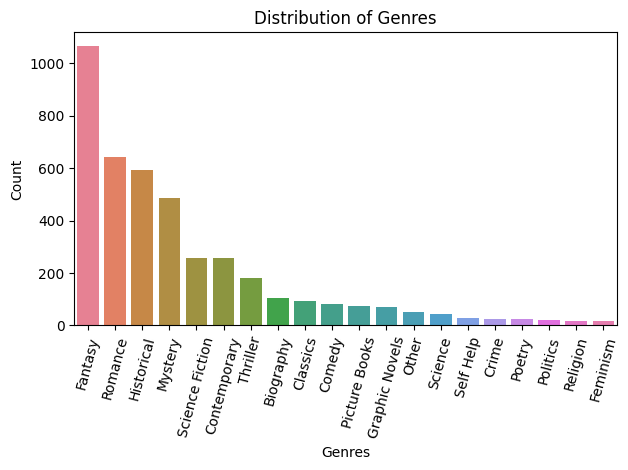
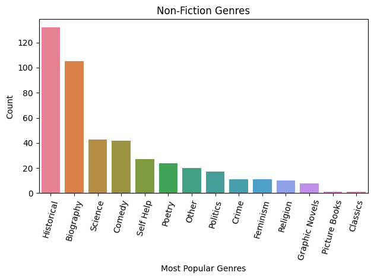

As a lover of fantasy (and dragon) and a keen Goodreads user, for this project I wanted to explore the top genres for fiction and non-fiction, and draw comparisons to my own reading habits.

I wanted to explore some datasets that would help me answer the following questions:
1. What are the most popular genres?
2. What are the highest rated books?

### Data Collecting
I used the following dataset from kaggle.com:
-  **Top Goodreads Books (1980-2023)**: https://www.kaggle.com/datasets/cristaliss/ultimate-book-collection-top-100-books-up-to-2023 

This dataset looked at the top 100 books for each year between 1980 and 2023, according to Goodreads, and includes genres, book length, average rating, and the number of people interested in reading each book. It is made up of 4400 indexes and 20 columns.


")

<!-- 
3. **Personal dataset**

This dataset is created from my own personal library spreadsheet which documents my physical and electronic book collection as well as some details about each book (e.g. whether I have read it and what genre it is). It is made up of 278 indexes and 12 columns.

.png "df.sample(5)")
 -->


### Importing Libraries 
For this project, I imported the following Python libraries:
```python
import pandas as pd
import numpy as np
from matplotlib import pyplot as plt
import seaborn as sns
```
I then called the **.read_csv()** method so that I could turn my dataset into a DataFrame, and explored the dataset so that I could clean, checked if anything needed to be amended or removed, looked for NaNs, and got to cleaning.  

### Data Cleaning

By calling the **.info()** method on this DataFrame, I was able to identify some things that needed cleaning:

") 

Firstly, there were several columns I wasn't interested in, for example the description and goodreads url for each book weren't relevant for the questions I wanted to answer.

So I dropped these columns using the following code:
```python
cols_to_drop2 = ['Unnamed: 0', 'isbn', 'series_title', 'description','format', 'url']

goodreads_clean_df = top_goodreads_df.copy() #tracking changes
goodreads_clean_df = goodreads_clean_df.drop(cols_to_drop2, axis=1)
```

<!-- below: wasn't relevant to my research -->
<!-- Next, I decided to rename the column *series_release_number* to *series_number* and convert any NaNs in the column to 0 as this with indicate that book wasn't a part of a series. 
```python
goodreads_clean_df = goodreads_clean_df.rename(columns={'series_release_number':'series_number'}).fillna(0)
``` -->

I also had some columns that should have been integers but were instead float or object types. To address this, I created a list named **num_cols** containing the columns I wanted to convert:
```python
num_cols = ['num_pages' ,'current_readers', 'want_to_read', 'num_ratings', 'num_reviews']
```
I then passed my list into the DataFrame and called the **.astype()** method. 
```python
goodreads_clean_df[num_cols] = goodreads_clean_df[num_cols].astype(int)
```
However, here I encountered the following **ValueError**:
```python
ValueError: invalid literal for int() with base 10: '290 page'
``` 
As it turned out, the values in the *num_pages* column sometimes included the word 'pages', as became clear when I called the **.unique()** method on the column.

To combat this, I created the following function to check for the word 'pages' in the *num_pages* values.
```python
def convert_to_int(x):
  try:
    return int(x.replace(' pages',''))
  except:
    return int(x)
```
If my function found the word in a value, it would remove it (by replacing it with empty space) and cast the string to an integer. When the word wasn't found, my function would simply cast the string to integer. 
In order to do this I had to use the .apply() method to call my function:
```python
goodreads_clean_df['num_pages'] = goodreads_clean_df['num_pages'].apply(convert_to_int)
``` 
As a result, the values of *num_pages* became integers and I was able to rerun my earlier code (excluded 'num_pages') to turn **num_cols = ['current_readers', 'want_to_read', 'num_ratings', 'num_reviews']** into integers.

Next I removed some duplicates by calling the **.drop_duplicates()** method: 
```python
unique_goodreads = goodreads_clean_df.drop_duplicates(subset=['title'])
```
This worked by checking for duplicated title names (by checking the *title* column) and dropping (i.e. removing) repeated names. By default **.drop_duplicates()** keeps the first occurrence of the title. 

I then called **.info()** to checked the data types had been changed.

") 

And took a look at my clean DataFrame:
") 

### Genres
Next, I needed to do something about the *genres* column as each value was made up of a list-like object data type like this:
") 

To address this, I first created a copy of my DataFrame and used the **.str.extract()** method to create a new column (called *gen_type*) that would differentiate fiction from non-fiction:
```python
genre_type = unique_goodreads.copy()
genre_type['gen_type'] = genre_type['genres'].str.extract(r'(Fiction|Nonfiction)')
```
This worked by extracting the string (.str) 'Fiction' or 'Nonfiction' from the *genres* column and then adding it to the new column, with the help of regular expression (represented by 'r') to allow me to find 'Fiction' OR 'Nonfiction' (rather than the presence of both at once).

Following this I needed to created a new genre column, assigning only one genre to each books as that would be more manageable than 7 genres per book.  

Using the **.value_counts()** and **.head()** methods I determined which genres I wanted to use - I identified more generalised genres from the top 20 most common arrays, excluding fiction or non-fiction.

```python
top_genres_df = genre_type.copy()
top_genres_df['genre'] = top_genres_df['genres'].str.extract(r'(Fantasy|Mystery|Thriller|Graphic Novels|Romance|Historical Fiction|\
              Historical|History|Crime|Science Fiction|Science|Biography|Classics|Self Help|Feminism|\
              Horror|Comedy|Humor|Politics|Poetry|Contemporary|Picture Books|Religion)', expand=False)
```

I also ignored any age specific words (such as *childrens* or *young adult*) as I felt they were too vague (age specific words were grouped with anything from fantasy to mystery) and I wanted to look at more typical genres (e.g. *Fantasy, Romance, True Crime*' etc). 

'Historical Fiction' and 'History' were renamed as 'Historical' in order group them using  **.replace()** on the series.
```python
top_genres_df['genre'] = top_genres_df['genre'].replace('Historical Fiction', 'Historical')
top_genres_df['genre'] = top_genres_df['genre'].replace('History', 'Historical')
```
Likewise, I also renamed *Humor* as *Comedy* to join the two genres.
```python
top_genres_df['genre'] = top_genres_df['genre'].replace('Humor', 'Comedy')
```
<!-- The genre 'Science Fiction was also renamed to 'SciFi' as I noticed that books with that genre were being labelled as 'Science'.
```python
top_genres_df.loc[scifi.index, 'genre'] = 'SciFi' -->
```
Whilst building my generalised list of genres, to ensure that I categorised all books, I called the **.isna()** method against the series I was creating, *genre*. Once I had accounted for the majority of books in the dataset, the more obscure genres were transformed into 'Other' using **.fillna()**.

```python
top_genres_df['genre'] = top_genres_df['genre'].fillna('Other')
top_genres_df.head()
```

Next I utilised **.isna()** to check for NaNs in the *gen_type* column. I then reassigned any books that were clearly fiction (or non-fiction) to the correct *gen_type* value, and Googled a few I wasn't sure about. After I was finished I called **.info()** on my DataFrame to check all NaNs had been dealt with.

") 


### 1. What are the most popular genres?
To answer this question, I first created a series of my genres and their unique count (i.e. number of occurrences of each genre) by calling the **.value_counts()** method, and called it *gen_count*.
```python
gen_count = goodreads_df.genre.value_counts()
```
Then I plotted a bar graph using the following code:
```python
sns.barplot(x=gen_count.index, hue=gen_count.index, y=gen_count.values, palette='husl')
plt.title('Distribution of Genres')
plt.xlabel('Genres')
plt.ylabel('Count')
plt.xticks(rotation=75)  
plt.tight_layout()  
plt.show()
```
The following bar graph indicates that the most popular genre, by far, was *Fantasy*. Least popular were *True Crime*, *Feminism*, and *Religion.*
 

However, I wanted to dive further and so I proceeded to separate fiction from non-fiction.

Starting with non-fiction, I created a mask (*nf_gen_msk*) to filter my DataFrame by the gen_type 'Nonfiction:
```python
nf_gen_msk = goodreads_df[goodreads_df['gen_type'] == 'Nonfiction']
```
I than turned my DataFrame into a series called *nf_gen_count* and applied my mask to it. This produced a series of genres and their count, filtered by non-fiction.
```python
nf_gen_count = nf_gen_msk['genre'].value_counts()
```
I was then able to create a bar graph using the following code:
```python
sns.barplot(x=nf_gen_count.index, hue=nf_gen_count.index, y=nf_gen_count.values, palette='husl')
plt.title('Non-Fiction Genres')
plt.xlabel('Most Popular Genres')
plt.ylabel('Count')
plt.xticks(rotation=75)  
plt.tight_layout()  
plt.show()
```
However, I wanted to check on some of the genres in my plot as at first glance they looked incorrectly labelled as non-fiction. To do this I filtered my DataFrame by the non-fiction *gen_type*:
```python
nf_type = nan_gen_type[nan_gen_type['gen_type'] == 'Nonfiction'] 
```
Next I filtered by *genre*. I checked the following genres within non-fiction: 'Graphic Novels', 'Crime', 'Politics', 'Classics', 'Childrens', and 'Horror'. Then I called the **.unique()** method on the *genre* column of my filtered DataFrame to extract the original genres.
```python
type_check = nf_type[nf_type['genre']=='Graphic Novels'] 
type_check['genres'].unique()
```
This allowed me to verify that they were all correctly labelled as non-fiction by producing the following output:
") 

I was then able to plot my bar graph, illustrating the non-fiction genres:
 

This indicates that the most popular non-fiction genre is **Historical**, followed by **Biography**. 

The top 5 non-fiction genres are:

 

Similarly to the non-fiction genres, I also checked some of the fiction genres (e.g. 'feminism'), but again they were correctly labelled.

The following bar graph illustrates the top fiction genres:

 

As you can see, the most popular genre for fiction is **Fantasy**. 

The top 5 fiction genres are:

 

In both instances I can't comment on the least popular genres as the original dataset was only looking at the top 100 books every year between 1980-2023, and therefore it's possible that the least popular genres weren't included. However, of the dataset I do have, 
I can see that *Classics* and *Picture Books* were the least popular Non-Fiction genres. Similarly, for fiction, the least popular genre was *Politics*, followed by *Feminism*, and *Religion*.


<!-- ### 2. What are the highest rated books? 
  


  -->


<!-- ### 3. Me, myself, and I:
Now the fun part, how does all this reflect my own reading habits?


color='orchid'
color='lightblue'
color='mediumpurple' -->


<!-- ### Conclusions
- The most popular genre in fiction is fantasy
- The most popular genre in non-fiction is historical

- 
- 

 

### Aftermath - What did I learn?
Through this project

Though I didn't end up using it, I did learn about **.explode().** This method can transform list-like elements (e.g. the genre lists in the original *genres* list of my reading habits DataFrame) into individual rows, with each element of the list getting its own row, like this:
 

 -->


<!-- #### Extensions:

Do men (18 yrs+) read more non-fiction than women?
Do more people listen to audiobooks than read physical books? 
delve deeper into the genres
-->

