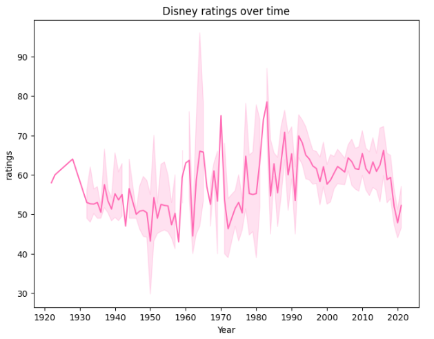

Having previously worked with Seaborn, I thought it would be fun (and informative) to explore some of the different visualisations you can create with with it. To make things even more *exciting* I also ran Jupyter notebook locally. To do this I first needed to opened my terminal/command line interface (CLI) and *pip install jupyter*. I then launched my Jupyter Notebook server. This opened the Jupyter Notebook interface on my web browser and allowed me to create a new notebook or open an existing one. Previously I used Google Colab as it's easily accessible on any device (and no need to install python or pandas etc on your device).

From the most commonly use visuals, like line or bar plots (or line/bar graphs as your average person would call them) and pie charts, to the more obscure/less widely known violin plots and facet grids, Seaborn is an impressive data visualisation library that can be used with Pandas and allows you to customise extensively. In this project I will be going through several plots and explaining how and why you might want to use them.

The plots can be broken down into the following categories/type:
- **Relational Plots** (e.g. scatter plots) - as the name suggests, these plots show the relationship between 2 or more variables.
- **Regression Plots** (e.g. regplot) - these show relationships between variables using a regression model.
- **Categorical Plots** (e.g bar plot) - these show categorical data as ‘bars’.
- **Distribution Plots** (e.g. boxplots and histograms) - these plots are used to show the distribution of data.
- **Matrix Plots**(e.g. heatmaps) - these are used to visualise data in a matrix form.
- **Multi-Plot Grids** (e.g. facet grids) - these are used for plotting multiple plots in a grid layout.
- **Pairwise Relationships** (e.g. pairplots) - relationship across a pair of plots
- **Joint Plots** - these combine univariate and bivariate plots to show relationships between two variables.
- **Time Series Plots** (e.g. line plot) - these are used to visualise time series data.

### Importing Libraries & Data Collecting
To begin with I imported the following libraries:

```python
import pandas as pd
from matplotlib import pyplot as plt
import seaborn as sns
```
 
I used several datasets in this project, each of which required a little data cleaning and transforming to fit my purpose.

The datasets I used were:
1. MoviesOnStreamingPlatforms.csv: https://www.kaggle.com/datasets/ruchi798/movies-on-netflix-prime-video-hulu-and-disney

For this dataset all I did was drop a couple columns, created a column with ratings out of 100 as integers (the original data had them as object types). 
```python
movie_ratings_df = movies.copy().drop(columns=['Unnamed: 0', 'ID'])
movie_ratings_df['ratings'] = movie_ratings_df['Rotten Tomatoes'].str.replace('/100', '').fillna('0').astype(int)
```

I also filtered my Dataframe by Disney movies as I wasn't interested in the other streaming platforms.
```python
disney_df = movie_ratings_df.copy().drop(columns=['Netflix', 'Hulu', 'Prime Video'])
disney_df = disney_df[disney_df['Disney+'] == 1] 
```
The final Dataframe looked like this: 

 


2. penguins_lter.csv: https://www.kaggle.com/datasets/parulpandey/palmer-archipelago-antarctica-penguin-data 

For this dataset I dropped some columns I didn't care about and removed some NaNs.

```python
penguin_df = penguin_lter.dropna(subset=['Sex']) #drop NaNs from Sex column
penguin_df = penguin_lter.drop(columns=['Sample Number', 'Individual ID', 'Stage', 'Clutch Completion', 'Clutch Completion', 'Date Egg', 'Comments'])
penguin_df.head()
```

The final Dataframe looked like this: 

 

3. I did then learn that Seaborn actually has some built-in datasets so made use of some of these;
- iris = sns.load_dataset('iris')

This Dataframe looked like this: 

 


### Relational Plots

- Scatterplot - useful for showing a relationship between variables, identifying patterns and trends, as well as any outliers within the data.

A simple scatter plot needs to include the type of plot (*sns.scatterplot* in this case, with sns representing Seaborn), followed by the parameters *x, y,* and *data* with their corresponding values within circle brackets. 

For example;
```python
sns.scatterplot(x='Year', 
                y='ratings', 
                data=disney_df)
```
Here you can also change the colour by including *color='hotpink'* as a parameter. There are, however, several parameters you can include such as *legend* or *hue* which can be used to differentiate data points by colour, typically to represent an additional categorical variable (e.g. gender).

Next you can add things like titles and axis labels:
```python
plt.title('Rotten Tomatoes rating for Disney movies by year')
plt.ylabel('Ratings out of 100')
```
Or set the range for the axis tickers: 
```python
plt.yticks(ticks=range(0,100,5)) #0 to 100, increment by 5
plt.xticks(ticks=range(1920, 2024, 10)) #1920 to 2024, increment by 10
```
This will produce the following scatterplot, showing the relationship between Disney movie ratings and Year of release:

 

This shows a cluster pattern between 2000-2020, showing an increase in movies being released but also a mix of good and bad ratings, though you can also see that more movies with a high rating have been relseas in recent years - higher rated movies pre 2000 were quite sporadic. 

### Regression Plots
You can also add a regression line, also know as a line of best fit and is useful for displaying the relationship of your variables, using the following methods:

- **regplot**
```python
sns.regplot(x='Year', 
            y='ratings', 
            data=disney_df,
            scatter=False, # Disable scatter points to avoid duplicate points
            color='skyblue')
plt.ylabel('Ratings out of 100')
```
This method is a simple and straightforward method that allows you to add a regression line on top of your scatter plot. It's useful when you need to quickly visualise the linear relationship between two variables.

 

- **lmplot**
```python
sns.lmplot(x='Year', 
                y='ratings', 
                height=6,
                aspect=1.5,
                data=disney_df,
                scatter_kws={'color': 'turquoise'}, #change colour of scatter points
                line_kws={'color': 'hotpink'})  # Change regression line colour
plt.title('Rotten Tomatoes rating for Disney movies by year')
plt.ylabel('Ratings out of 100')
plt.yticks(ticks=range(0,105,5))
plt.xticks(ticks=range(1920, 2024, 10))
plt.show()
```
This method is more powerful and flexible, allowing for more complex visualisations including faceting by multiple categories. It is particularly useful when you want to create multi-plot grids based on the levels of a categorical variable.

 

A regression line can be beneficial as it offers a visualisation of any trends and relationships between your variable. It can also be used to predict future outcomes, identify outliers, and summarise your data.

In this instance, the regression line suggests that there is no strong trend in the ratings over time as it it fairly flat. This implies that the average Rotten Tomatoes rating for Disney movies has remained relatively stable over the decades.

However, there is significant variability in the ratings, especially in recent years (1990s onwards), indicating that Disney has released movies with very high and very low ratings. Earlier years (1930s to 1950s) show fewer movies, with a tendency towards lower ratings compared to later years.

<!-- relplot: A figure-level function for creating scatter and line plots. -->

### Categorical Plots

- Bar plot - useful for visually comparing data from different categories or groups.

Here is my bar plot, showing culmen length with each bar representing a different species of penguin.

 

We can also incorporate the **hue** parameter here to further group the data, i.e. by sex.
```python
sns.barplot(data=penguin_df, x='Species', y='Culmen Length (mm)', hue='Sex', palette='mako')
plt.xticks(ticks=[0, 1, 2], labels=['Adelie', 'Chinstrap', 'Gentoo'])
plt.title('Culmen Length of Penguins by sex and species')
plt.show()
```

 

These bar plots show that Chinstraps have the longest culmensand also that male penguins have longer culmens than females.

- Count plot - useful for for visualising the distribution of categorical data. 
```python
sns.countplot(data=penguin_df, x='Species', color='turquoise')
plt.show()
```

 

This count plot shows that the data contained more Adelie penguins than the other 2 species - this can also be shown by calling the **value_counts()** method on the *Species* column, but this is more visually pleasing. With this plot, we get an idea of the composition of the data which can be important for any subsequent analysis, as in this case the majority of the data (~44%) is made up of Adelie penguins, with Gentoo penguins making up ~20%, skewing the data and possibly affecting any conclusions drawn. 
  
- Point plot - useful for comparing the central tendency and variability of a numerical variable across different levels of one or more categorical variables.

```python
sns.pointplot(data=penguin_df, x='Species', y='Culmen Length (mm)', hue='Sex', palette='viridis')
plt.show()
```

 

This shows the average (i.e. mean) culmen length (represented by points) for male and female penguins across different species, highlighting the variations in culmen length between species and sexes. The error bars (vertical lines through each point) provide insight into the variability and confidence in these mean values. And finally, the lines connecting the points show the trend across the different species. 

### Distribution Plots

- Box plot - this plot (also known as a box-and-whisker plot) is one of the most well known distribution plots, alongside a histogram (or histplot). The box part shows the quartiles of the data, whilst the whiskers extend to show the rest of the distribution, excluding outliers - these are shown as dots beyond the whiskers. It is useful for exploring the relationship between categorical and a continuous variables

To create my boxplot, I used the following piece of code:

```python
sns.boxplot(data=penguin_df, x='Species', y='Body Mass (g)', palette='mako', hue='Species')
plt.xticks(rotation=45)  
plt.xticks(ticks=[0, 1, 2], labels=['Adelie', 'Chinstrap', 'Gentoo'])
plt.title('Body Mass Distribution by species')
plt.show()
```
For better readability, I used the **plt.xticks()** function to rotate and simplify my x-axis ticker labels as they included the scientific names for each penguin species. The *rotation* parameter allowed me to rotate the labels by 45 degrees, *ticks* let me to set the location of the ticks, and *labels* let me set the new labels.

 

This boxplot shows the distribution of body mass for three species of penguins; Adelie, Chinstrap, and Gentoo. It shows that Gentoo penguins have a significantly higher body mass compared to Adelie and Chinstrap penguins, and Chinstrap penguins have a slightly lower body mass compared to Adelie penguins, with a few outliers on the lower side.

- Boxen plot (an enhanced box plot) - useful when you have a large number of data points and want a more informative summary of the distribution than you'd get from a box plot.
This type of plot shows more quantiles so as to provide more information about the shape of the distribution.

For my boxen plot, I looked at the distribution of body mass by gender. This time I used **sns.boxenplot()** to create my plot, setting the x-axis as 'Sex' and the y-axis as 'Body Mass (g)'.

 

This boxen plot shows that male penguins tend to have a higher and more varied body mass compared to females.


- Violin plot - this plot shows the distribution of data points after grouping them by a variable(s). Each 'violin' represents a kernel density estimate (KDE) of the underlying distribution. It is useful for comparing distributions and understanding the density of data across different categories.

For my violin plot, I looked at the distribution of culmen length by gender and species. To do this, I called *sns.violinplot,* set my x and y axises appropriately and incorporated 'Sex' into the *hue* parameter to differentiate the plots by gender. I also repositioned the legend to the upper left to enhance readability.

```python
sns.violinplot(data=penguin_df, x='Species', y='Culmen Length (mm)', hue='Sex', palette='mako')
plt.xticks(ticks=[0, 1, 2], labels=['Adelie', 'Chinstrap', 'Gentoo'])
plt.legend(loc="upper left")
plt.title('Culmen Length Distribution by species and sex')
plt.show()
```

 

This indicates that Adelie penguins have significantly shorter culmens compared to the other species. Additionally, females generally have shorter culmens across all three species, although Chinstrap females exhibit the most variation in culmen length.

- Strip plot - While a strip plot can stand alone, it also serves as an excellent complement to a box or violin plot when you want to display all individual observations alongside a depiction of the underlying distribution. It is useful for visualising the distribution of data points and identifying clustering or patterns in the data.

This type of plot looks like this:

 

This type of plot is useful when you need a detailed visualisation of individual data points, especially in smaller datasets, or when used in conjunction with summary plots like box or violin plots.

- Swarm plot - similar to a strip plot, this plot arranges points along the categorical axis to prevent overlap, providing a clearer representation of value distribution. However, it may not be suitable for large datasets. This type of plot is also known as a "beeswarm". It is useful when you have a moderate amount of data and want to show individual data points while maintaining clarity and avoiding overlap.

 

Similarly to strip plots, swarm plots are also good for visualising individual data points without overlap, making them ideal for small to medium-sized datasets, comparing categories, and highlighting distribution patterns.

- Histplot (aka histogram) - useful for visualising the shape and distribution of data, particularly when using continuous numerical data and to show frequency and density of data.

Here is a histogram showing the distribution of movies by release year. 

```python
sns.histplot(disney_df, x='Year', color='hotpink')
plt.title('Distribution of Disney Movies between 1920-2020')
plt.show()
```
 

This hows that most Disney movies have been released in the most recent decade. It is very clear from this plot, but you may wish to add a Kernel Density Estimate (KDE). 

- KDE plot (Kernel Density Estimate) - useful for simply visualising the shape and spread of the data. However, it runs the risk of oversimplifying and distorting the data if used on its own so it works best ontop of a histplot.

You can add a KDE over a histplot by including the parameter **kde=True**.

 

<!-- - ECDF plot (Empirical Cumulative Distribution Function):  -->
<!-- displot: A figure-level function for creating histograms and KDE plots. -->

### Matrix Plots

- Heatmap - good for exploring relationships in a matrix-like dataset. They employ a colour gradient to represent variations in data values, making it easier to discern trends, clusters, or outliers within the data. They are useful for visualising relationships and patterns in large datasets.

To create my heatmap, first I created a filtered Dataframe like so:
```python
adelie_matrix = penguin_df[penguin_df['Species']=='Adelie Penguin (Pygoscelis adeliae)']
adelie_matrix = adelie_matrix.drop(columns=['Species','studyName', 'Region', 'Island', 'Sex', 'Delta 15 N (o/oo)', 'Delta 13 C (o/oo)'])
```

This resulted in a Dataframe (called *adelie_matrix*) containing numerical data regarding Adelie penguins.

") 

In order to create a heatmap I call the **heatmap()** function and pass my Dataframe, with the **.corr()** method attached, as the parameter. This allowed me to create pairwise correlations of my columns. I also gave it a title and changed the colour palette.

```python
sns.heatmap(adelie_matrix.corr(), cmap='mako_r')
plt.title('Correlation Heatmap of Adelie Penguin Measurements')
plt.show()
```
The resulting heatmap looked like this.

 

From my heatmap we can see that the strongest positive correlation is between culmen depth and body mass with a score or about 0.6, the lowest being culmen depth and flipper length. Knowing this can guide hypotheses or further research questions about how these physical characteristics interact or influence each other.

<!-- - Cluster map (hierarchically-clustered heatmap) is a slight variation of a heatmap  -->

### Multi-Plot Grids

- FacetGrid - this is feature in the Seaborn library allows you to plot multiple subsets of your data in a grid like format, using specific (or multiple) types  of plots (e.g. scatter, line, bar, box, violin). It is useful for creating a grid of plots based on the levels of one or more categorical variables, making it easy to visualise complex relationships. You can also further customise a FacetGrid by modifying the layout, appearance, and behaviour of the plots within each facet, including adjusting axis labels, titles, legends, and more.

Using FacetGrid effectively allows you to explore and present complex datasets in a structured and visually appealing manner.


The following grid incorporates histplots to keep things simple.

 

To create this I used the following piece of code:

```python
peng = sns.FacetGrid(penguins, col='species', row='sex', hue='sex', palette="mako_r", sharex=False)
peng.map(sns.histplot, 'bill_length_mm')
plt.show()
```
My *col* and *row* parameters specify that I want to organise my grid with *species* as my columns (left to right) and *sex* as my rows (top and bottom), and *hue* allows me to colour the plots by *sex*. Finally, the *sharex=False* parameter specifies that the x-axis should not be shared across the different facets, meaning each subplot can have its own x-axis range which is often more clear.

### Pairwise relationships

- Pair plot - useful for visualising pairwise relationships across an entire dataframe (or specific columns) and displaying the distribution of each variable along the diagonal.

To create my pair plot I used the folowwing piece of code which allowed me to pick the columns to include and to group by species:
```python
sns.pairplot(x_vars = ['Culmen Length (mm)', 'Culmen Depth (mm)', 'Flipper Length (mm)', 'Body Mass (g)'],
             y_vars = ['Culmen Length (mm)', 'Culmen Depth (mm)', 'Flipper Length (mm)', 'Body Mass (g)'],
             hue = 'Species',
             data = penguin_df)
plt.suptitle('Pairplot of Penguin Measurements by Species', y=1.02)
plt.show()
```
 

Another way of displaying this data is through a pair grid incorporating scatter plots.

- Pair Grid - this type of plot lets you choose the type of plots to include, where to place them, and lets you include multiple types of plots.

To create a simple scatter plot pair grid, I used a similer piece of code to my pair plot, the main change (other than changing *sns.pairplot()* to *sns.PairGrid*) was adding *pg.map(sns.scatterplot)*:
```python
pg = sns.PairGrid(penguin_df,
                 x_vars = ['Culmen Length (mm)', 'Culmen Depth (mm)', 'Flipper Length (mm)', 'Body Mass (g)'],
                 y_vars = ['Culmen Length (mm)', 'Culmen Depth (mm)', 'Flipper Length (mm)', 'Body Mass (g)'],
                 hue='Species',
                 palette='cubehelix')
pg.map(sns.scatterplot)
pg.add_legend()
plt.suptitle('Pair Grid showing Penguin Measurements by Species', y=1.02)
plt.show()
```
This produces a figure like this:

 

Pair Grid also allows me to use the **.map_upper()**, **.map_lower()**,  **.map_diag**, and **.map_offdiag()** functions to chose the types of plots for different parts of the grid.

The following grid is a variation of my Pair Grid but with these modifications:
```python
pg2.map_upper(sns.scatterplot)
pg2.map_lower(sns.kdeplot)
pg2.map_diag(sns.histplot)
```
 

### Joint Plots

**jointplot** and **JointGrid** serve similar purposes in Seaborn, they provide a visualisation of the relationship between two variables as well as their distribution, but offer different levels of customisation and flexibility.

- Joint plot is a high-level function that creates a JointGrid under the hood and is useful for quickly generating a plot with marginal distributions (i.e. distributions of individual variables ). A joint plot is more simple to use and requires fewer lines of code, but is less customiseable than a full Joint Grid.

Here is how I created my joint plot:

```python
ir = sns.jointplot(data=iris, x="sepal_length", y="petal_length", 
              hue='species', 
              palette='husl')
plt.show()
  ```

 

As you can see from the central plot (the scatter plot), there is a positive correlation between petal length and sepal length; this suggests that irises with longer sepals tend to also have longer petals. However, setosa irises tend to have shorter petals and sepals than the other to species og irises.

Meanwhile, the marginal distributions are shown as KDE plots (typically they appear as histograms unless you utilise *hue* to group by a category) on the top and right side. The top KDE plot shows the distribution for petal length by species (setosa in pink, versicolor in green, and virginica in blue), while the right does the same for sepal length.

- a Joint Grid, however, is a lower-level class that offers more control and customisation. It allows you to define the main and the marginal plots separately, giving you more control over the final figure.

As with the joint plot, you start by calling your plot (this time *sns.JointGrid()* rather than *sns.jointplot()*) and passing your parameters (at least data, x, and y). 
```python
ir2 = sns.JointGrid(data=iris, x="sepal_width", y="petal_width",
              hue='species', 
              palette='husl')
```

Next you chose your plot types.

```python
ir2.plot(sns.scatterplot, sns.histplot)
```
This will produce a figure that looks like this.

 

I have kept the main plot as a scatter and used histograms for my marginal plots, but you can also use KDE, regplot, boxplot etc. You can also use **plot_joint()** and **plot_marginals()** and add your plot types as parameters - this allows you to further customise each plot, adding things like regression lines, adjusting the shape / size / opacity of your scatter points, or using different colour palettes for each plot, like so:
```python
ir2.plot_joint(sns.scatterplot, s=100, palette='husl', marker="+")
ir2.plot_marginals(sns.histplot, kde=True, palette='mako')
```

With this code you would get a joint grid that looks like this:
 

The joy of Seaborn is that you have numerous options of things to add, remove, or adjust. So go nuts!

### Time Series Plots

- Line plot - these show data along a continuous interval or time span and are useful for visualising trends and patterns. They include a line which shows the trend over the timeline used, and a shadow outlining it which represents the confidence interval. 

 

This plot offers a visual representation of how Disney ratings have evolved over time, highlighting both trends and variability in the data. We can see that ratings have been widely varied, started improving from the early 2000s, but have since had a decline. 

As with most plots, line plots are highly customiseable and also integrate well with Pandas and Matplotlib, making them an excellent choice for visualising time series and continuous data.

### So which plot should you use?
- **Scatter Plot**: Ideal for displaying relationships between two variables and identifying patterns, trends, and outliers.
- **Regplot/Lmplot**: Shows linear relationships between two variables with a regression line, useful for understanding the strength and direction of the relationship.
- **Bar Plot**: Compares the size of different categories. Ideal for summarising data across categorical variables.
- **Point Plot**: Displays the central tendency and variability of a numerical variable across different categorical levels. It is useful for comparing summary statistics between categories.
- **Count Plot**: Effective at showing the distribution of categorical data.
- **Box Plot**: Good for exploring the distribution of a continuous variable across different categories. It highlights median values, quartiles, and potential outliers.
- **Boxen Plot**: Provides an advanced version of a box Plot**, with more detail on distribution, especially useful for large datasets with many observations.
- **Violin Plot**: Combines aspects of box plots and density plots to show data distribution across categories, including data density and distribution shape.
- **Strip Plot**: Visualises the distribution of data points and helps identify clustering or patterns.
- **Swarm Plot**: Shows individual data points clearly in moderate-sized datasets and avoids overlap. It is useful for visualising the distribution of data without clutter.
- **Histplot / Histogram**: Displays the shape and distribution of continuous numerical data, highlighting frequency and density.
- **KDE Plot (Kernel Density Estimate)**: Useful for visualising the shape and spread of data.
- **Heatmap**: Quickly reveals relationships and patterns in large datasets.
- **Facet Grid**: Creates a matrix of plots based on levels of a categorical variable, useful for visualising complex relationships.
- **Pair Plot**: visualises pairwise relationships across a dataframe and shows the distribution of each variable. For more customisation options, use a PairGrid.
- **Joint Plot**: Combines scatter plots with histograms and density plots to show both joint and marginal distributions. For more customisation options, use a JointGrid.
- **Line Plot**: Best for visualising trends and patterns in time-series data.

### Conclusion

Seaborn has a wide selection of plots and charts, all with their own documentation which I highly recommend, with numerous customisations for the user to utilise (anything from changing the colour and sise, to altering the labels, grouping by specific categories, to stacking or showing multiple plots side-by-side in a grid). Some are weird, some are wonderful, and some will become favorites.

Not only this, but Seaborn actually offers various in-built datasets for you to experiment with - all of which are super easy to load (so long as Seaborn has been imported) and, for the most part, don't need any cleaning, making it easy to have a go. 

These are some of the datasets and they can be loaded by using the **.load_datasets()** method;
- titanic = sns.load_dataset('titanic')
- iris = sns.load_dataset('iris')
- penguins = sns.load_dataset('penguins')
- diamonds = sns.load_dataset('diamonds')

My full notebook can be found here: https://www.kaggle.com/code/annieboskova/what-the-plot  