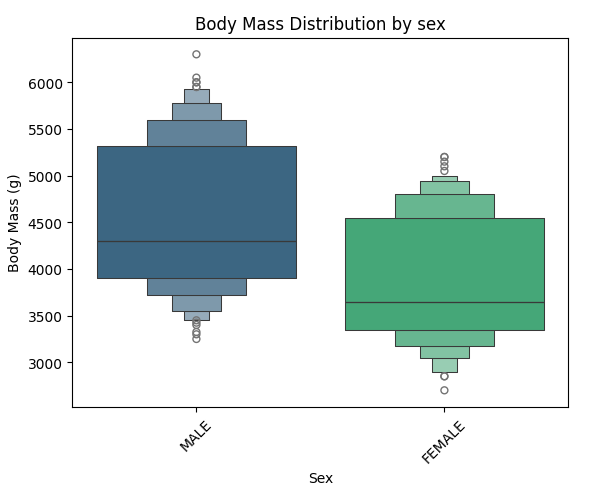
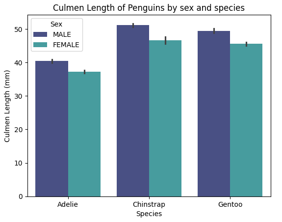

Having previously worked with Seaborn, I thought it would be fun (and informative) to explore some of the different visualisations you can create with with it. To make things even more exciting I also ran Jupyter notebook locally.

<!-- I'd go on to describe how previously you've used Collab and other tools and then describe what you are doing to use Jupyter locally.
Commands you are running and break them down -->

From the most commonly use visuals, like line or bar plots (or line/bar graphs as your average person would call them) and pie charts, to the more obsure/less widely known violinplots and facet grids, Seaborn is an impressive data visualisation library that can be used with Pandas and allows you to customise extensively. In this project I will be going through several plots and explaining how and why you might want to use them.

The plots can be broken down into the following categories/type:

relational plots (e.g. scatter plots) - as the name suggests, these plots show the relationship between 2 or more variables.

Categorical plots (e.g. boxplot) - these plots are used to show the distribution of data across different categories.

Distribution plots (e.g. histograms and KDE plots) - these show distribution of a singular variable.

Regression plots (e.g. regplot) - these show relationships between variables using a regression model.

Matrix plots (e.g. heatmaps) - these are used to visualise data in a matrix form.

Multi-plot grids (e.g. pairplots and facet grids) - these are used for plotting multiple plots in a grid layout.

Joint plots - these combine univariate and bivariate plots to show relationships between two variables.

Pairwise relationships (e.g. pairplots) - relationship across a pair of plots

Time Series Plots (e.g. line plot) - these are used to visualise time series data.

Statistical estimations (e.g. countplots) - these show statistical data estimates


### Importing Libraries
To begin with I imported the following libraries:

```python
import pandas as pd
import numpy as np
from matplotlib import pyplot as plt
import seaborn as sns
```

### Data Collecting
I used several datasets in this project, each of which required a little data cleaning and transforming to fit my purpose.

The datasets I used were:
1. MoviesOnStreamingPlatforms.csv: https://www.kaggle.com/datasets/ruchi798/movies-on-netflix-prime-video-hulu-and-disney

For this dataset all I did was drop a couple columns, created a column with ratings out of 100 as integers (the original data had them as object types). 
```python
movie_ratings_df = movies.copy().drop(columns=['Unnamed: 0', 'ID'])
movie_ratings_df['ratings'] = movie_ratings_df['Rotten Tomatoes'].str.replace('/100', '').fillna('0').astype(int)
```

I also filtered my Dataframe by Disney movies as I wasn't interested in the other streaming platforms.
```python
disney_df = movie_ratings_df.copy().drop(columns=['Netflix', 'Hulu', 'Prime Video'])
disney_df = disney_df[disney_df['Disney+'] == 1] 
```
The final Dataframe looked like this:  


2. penguins_lter.csv: https://www.kaggle.com/datasets/parulpandey/palmer-archipelago-antarctica-penguin-data 

For this dataset I dropped some columns I didn't care about and removed some NaNs.

```python
penguin_df = penguin_lter.dropna(subset=['Sex']) #drop NaNs from Sex column
penguin_df = penguin_lter.drop(columns=['Sample Number', 'Individual ID', 'Stage', 'Clutch Completion', 'Clutch Completion', 'Date Egg', 'Comments'])
penguin_df.head()
```

The final Dataframe looked like this:  

3. I did then learn that Seaborn actually has some built-in datasets so made use of some of these;
- iris = sns.load_dataset('iris')

This Dataframe looked like this:  


### Relational Plots

- scatterplot: A simple scatter plot needs to include the type of plot (*sns.scatterplot* in this case, with sns representing Seaborn), followed by the parameters *x, y,* and *data* with their corresponding values within circle brackets. 

For example;
```python
sns.scatterplot(x='Year', 
                y='ratings', 
                data=disney_df)
```
Here you can also change the colour by including *color='hotpink'* as a parameter. There are, however, several parameters you can include such as *legend* or *hue* which can be used to differentiate data points by colour, typically to represent an additional categorical variable (e.g. gender).

Next you can add things like titles and axis labels:
```python
plt.title('Rotten Tomatoes rating for Disney movies by year')
plt.ylabel('Ratings out of 100')
```
Or set the range for the axis tickers: 
```python
plt.yticks(ticks=range(0,100,5)) #0 to 100, increment by 5
plt.xticks(ticks=range(1920, 2024, 10)) #1920 to 2024, increment by 10
```
This will produce the following scatterplot, showing the relationship between Disney movie ratings and Year of release:

 

This shows a cluster pattern between 2000-2020, showing an increase in movies being released but also a mix of good and bad ratings, though you can also see that more movies with a high rating have been relseas in recent years - higher rated movies pre 2000 were quite sporadic. 

### Regression Plots
You can also add a regression line using the following methods:

- **regplot**
```python
sns.regplot(x='Year', 
            y='ratings', 
            data=disney_df,
            scatter=False, # Disable scatter points to avoid duplicate points
            color='skyblue')
plt.ylabel('Ratings out of 100')
```
This method is a simple and straightforward method that allows you to add a regression line on top of your scatter plot. It's useful when you need to quickly visualise the linear relationship between two variables.

 

- **lmplot**
```python
sns.lmplot(x='Year', 
                y='ratings', 
                height=6,
                aspect=1.5,
                data=disney_df,
                scatter_kws={'color': 'turquoise'}, #change colour of scatter points
                line_kws={'color': 'hotpink'})  # Change regression line colour
plt.title('Rotten Tomatoes rating for Disney movies by year')
plt.ylabel('Ratings out of 100')
plt.yticks(ticks=range(0,105,5))
plt.xticks(ticks=range(1920, 2024, 10))
plt.show()
```

This method is more powerful and flexible, allowing for more complex visualisations including faceting by multiple categories. It is particularly useful when you want to create multi-plot grids based on the levels of a categorical variable.

 

A regression line can be beneficial as it offers a visualisation of any trends and relationships between your variable. It can also be used to predict future outcomes, identify outliers, and summarise your data.

In this instance, the regression line suggests that there is no strong trend in the ratings over time as it it fairly flat. This implies that the average Rotten Tomatoes rating for Disney movies has remained relatively stable over the decades.

However, there is significant variability in the ratings, especially in recent years (1990s onwards), indicating that Disney has released movies with very high and very low ratings. Earlier years (1930s to 1950s) show fewer movies, with a tendency towards lower ratings compared to later years.

<!-- relplot: A figure-level function for creating scatter and line plots. -->


### Categorical Plots

To demonstrate some of these types of plots, I have used a dataset looking at some penguin measurements (body mass, culmen length and depth, and flipper length).

- **Box plot**: this plot (also known as a box-and-whisker plot) is probably the most well known distribution plot. The box part shows the quartiles of the data, whilst the whiskers extend to show the rest of the distribution, excluding outliers - these are shown as dots beyond the whiskers.

To create my boxplot, I used the following piece of code:

```python
sns.boxplot(data=penguin_df, x='Species', y='Body Mass (g)', palette='mako', hue='Species')
plt.xticks(rotation=45)  
plt.xticks(ticks=[0, 1, 2], labels=['Adelie', 'Chinstrap', 'Gentoo'])
plt.title('Body Mass Distribution by species')
plt.show()
```
For better readability, I used the **plt.xticks()** function to rotate and simplify my x-axis ticker labels as they included the scientific names for each penguin species. The *rotation* parameter allowed me to rotate the labels by 45 degrees, *ticks* let me to set the location of the ticks, and *labels* let me set the new labels.

 

This boxplot shows the distribution of body mass for three species of penguins; Adelie, Chinstrap, and Gentoo. It shows that Gentoo penguins have a significantly higher body mass compared to Adelie and Chinstrap penguins, and Chinstrap penguins have a slightly lower body mass compared to Adelie penguins, with a few outliers on the lower side.


- **Boxen plot** (an enhanced box plot): this type of plot shows more quantiles so as to provide more information about the shape of the distribution.

For my boxen plot, I looked at the distribution of body mass by gender. This time I used **sns.boxenplot()** to create my plot, setting the x-axis as 'Sex' and the y-axis as 'Body Mass (g)'.

 

This boxen plot shows that male penguins tend to have a higher and more varied body mass compared to females.


- **Violin plot**: this plot shows the distribution of data points after grouping them by a variable(s). Each 'violin' represents a kernel density estimate (KDE) of the underlying distribution.


For my violin plot, I looked at the distribution of culmen length by gender and species. To do this, I called *sns.violinplot,* set my x and y axises appropriately and incorporated 'Sex' into the *hue* parameter to differentiate the plots by gender. I also repositioned the legend to the upper left to enhance readability.

```python
sns.violinplot(data=penguin_df, x='Species', y='Culmen Length (mm)', hue='Sex', palette='mako')
plt.xticks(ticks=[0, 1, 2], labels=['Adelie', 'Chinstrap', 'Gentoo'])
plt.legend(loc="upper left")
plt.title('Culmen Length Distribution by species and sex')
plt.show()
```

 

This indicates that Adelie penguins have significantly shorter culmens compared to the other species. Additionally, females generally have shorter culmens across all three species, although Chinstrap females exhibit the most variation in culmen length.

- **Strip plot**: While a strip plot can stand alone, it also serves as an excellent complement to a box or violin plot when you want to display all individual observations alongside a depiction of the underlying distribution.

This type of plot looks like this:

 

This type of plot is useful when you need a detailed visualisation of individual data points, especially in smaller datasets, or when used in conjunction with summary plots like box or violin plots.

- **Swarm plot**: Similar to a strip plot, this plot arranges points along the categorical axis to prevent overlap, providing a clearer representation of value distribution. However, it may not be suitable for large datasets. This type of plot is also known as a "beeswarm".

 

Similarly to strip plots, swarm plots are also good for visualising individual data points without overlap, making them ideal for small to medium-sized datasets, comparing categories, and highlighting distribution patterns.


<!-- catplot: A figure-level function for creating categorical plots. -->


### Distribution Plots

- Histplot (aka histogram)

```python
sns.histplot(disney_df, x='Year', color='hotpink')
plt.title('Distribution of Disney Movies between 1920-2020')
plt.show()
```
 

- KDE plot (Kernel Density Estimate plot)

 

You can also just add a KDE over a histplot by including the parameter **kde=True**.
 

<!-- - ECDF plot (Empirical Cumulative Distribution Function):  -->
<!-- displot: A figure-level function for creating histograms and KDE plots. -->

### Matrix Plots

- Heat map: 

```python
plt.figure(figsize=(8, 6))
sns.heatmap(adelie_matrix.corr(), cmap='mako_r')
plt.title('Correlation Heatmap of Adelie Penguin Measurements')
plt.show()
```
 

<!-- - Cluster map (hierarchically-clustered heatmap) is a slight variation of a heat map  -->

### Multi-Plot Grids

- Facet Grid: the following grid incorporates histograms

 


### Pairwise relationships

- Pair plot: 

To create my pair plot I used the folowwing piece of code which allowed me to pick the columns to include and to group by species:
```python
sns.pairplot(x_vars = ['Culmen Length (mm)', 'Culmen Depth (mm)', 'Flipper Length (mm)', 'Body Mass (g)'],
             y_vars = ['Culmen Length (mm)', 'Culmen Depth (mm)', 'Flipper Length (mm)', 'Body Mass (g)'],
             hue = 'Species',
             data = penguin_df)
plt.suptitle('Pairplot of Penguin Measurements by Species', y=1.02)
plt.show()
```
 

Another way of displaying this data is through a pair grid incorporating scatter plots.

- Pair Grid - this type of plot lets you choose the type of plots to include (e.g. scatter, histo, KDE etc) and can include multiple types.

To create a simple scatter plot pair grid, I used a similer piece of code to my pair plot, the main change (other than changing *sns.pairplot()* to *sns.PairGrid*) was adding *pg.map(sns.scatterplot)*:
```python
pg = sns.PairGrid(penguin_df,
                 x_vars = ['Culmen Length (mm)', 'Culmen Depth (mm)', 'Flipper Length (mm)', 'Body Mass (g)'],
                 y_vars = ['Culmen Length (mm)', 'Culmen Depth (mm)', 'Flipper Length (mm)', 'Body Mass (g)'],
                 hue='Species',
                 palette='cubehelix')
pg.map(sns.scatterplot)
pg.add_legend()
plt.suptitle('Pair Grid showing Penguin Measurements by Species', y=1.02)
plt.show()
```
This produces a figure like this:

 

Pair Grid also allows me to use the **.map_upper()**, **.map_lower()**,  **.map_diag**, and **.map_offdiag()** functions to chose the types of plots for different parts of the grid.

The following grid is a variation of my Pair Grid but with these modifications:
```python
pg2.map_upper(sns.scatterplot)
pg2.map_lower(sns.kdeplot)
pg2.map_diag(sns.histplot)
```
 

### Joint Plots

**jointplot** and **JointGrid** serve similar purposes in Seaborn, but offer different levels of customisation and flexibility.

- Joint plot is a high-level function that creates a JointGrid under the hood and is useful for quickly generating a plot with marginal distributions. It is more simple to use and requires fewer lines of code, but is less customiseable than a full Joint Grid.

```python
ir = sns.jointplot(data=iris, x="sepal_length", y="petal_length", 
              hue='species', 
              palette='husl')
plt.show()
  ```

 

- a Joint Grid, however, is a lower-level class that offers more control and customisation. It allows you to define the main and the marginal plots separately, giving you more control over the final figure.

As with the joint plot, you start by calling your plot (this time *sns.JointGrid()* rather than *sns.jointplot()*) and passing your parameters (at least data, x, and y). Next you chose your plot types.

<!-- ```python
ir2 = sns.JointGrid(data=iris, x="sepal_width", y="petal_width",
              hue='species', 
              palette='husl') -->
```python
ir2.plot(sns.scatterplot, sns.histplot)
plt.show()
```
This will produce a figure like this.
 

### Time Series Plots

- Line plot: 

 


### Statistical Estimation

- Bar plot: 

```python
sns.barplot(data=penguin_df, x='Species', y='Culmen Length (mm)', color='lavender')
plt.xticks(ticks=[0, 1, 2], labels=['Adelie', 'Chinstrap', 'Gentoo'])
plt.title('Culmen Length of Penguins by species')
plt.show()
```
 

We can also incorporate the **hue** parameter here to group our data, e.g. by sex.
```python
sns.barplot(data=penguin_df, x='Species', y='Culmen Length (mm)', hue='Sex', palette='mako')
plt.xticks(ticks=[0, 1, 2], labels=['Adelie', 'Chinstrap', 'Gentoo'])
plt.title('Culmen Length of Penguins by sex and species')
plt.show()
```

 

- Point plot: 

```python
sns.pointplot(data=penguin_df, x='Species', y='Culmen Length (mm)', hue='Sex', palette='viridis')
plt.xticks(ticks=[0, 1, 2], labels=['Adelie', 'Chinstrap', 'Gentoo'])
plt.show()
```

 

- Count plot: 
```python
sns.countplot(data=penguin_df, x='Species', color='turquoise')
plt.xticks(ticks=[0, 1, 2], labels=['Adelie', 'Chinstrap', 'Gentoo'])
plt.show()
```

 


### Conclusion

Seaborn has a wide select of plots and charts, all with their own documentation which I highly recommend, with numerous customisations for the user to utilise (anything from changing the colour and size, to altering the labels,  grouping by specific categories, to stacking or showing multiple plots side-by-side in a grid). 

Not only this, but Seaborn actually offers various in-built datasets for you to experiment with - all of which are super easy to load (so long as Seaborn has been imported) and, for the most part, don't need any cleaning. 
For example;
- titanic = sns.load_dataset('titanic')
- iris = sns.load_dataset('iris')
- penguins = sns.load_dataset('penguins')
- diamonds = sns.load_dataset('diamonds')


<!-- My full notebook can be found here:  -->

<!-- ### Useful Links
- Scatter
- regplot
- LM plot
- box
- boxen
- strip
- swarm
- violin
- pair plot
- heat map
- facet grid


- https://seaborn.pydata.org/generated/seaborn.FacetGrid.html  -->
