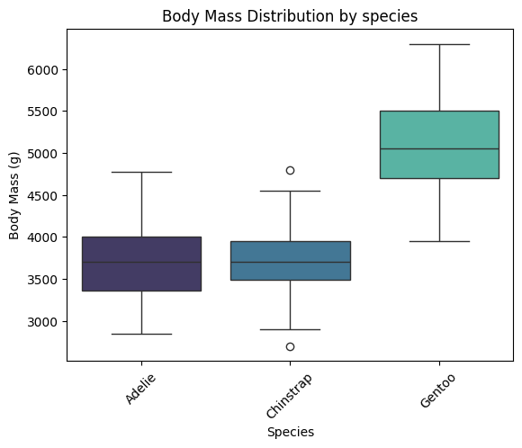
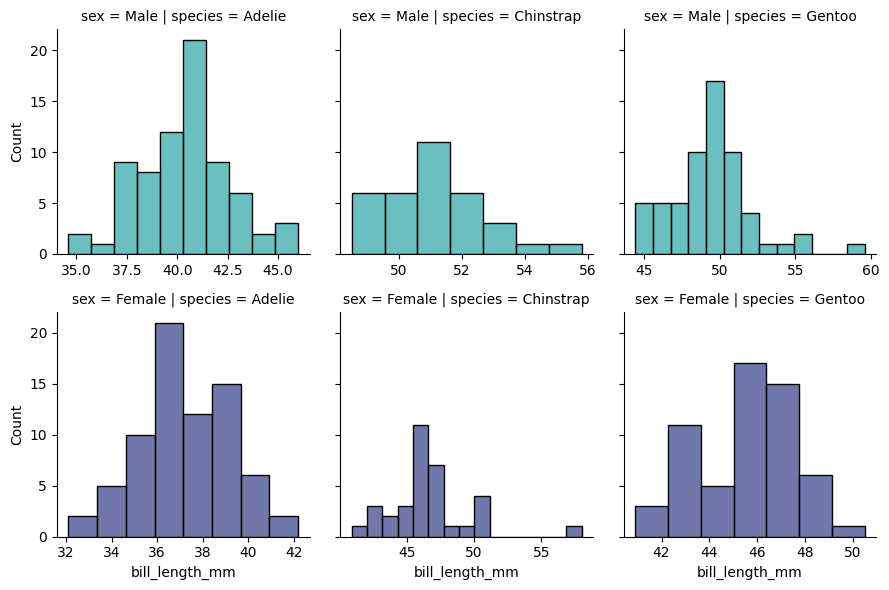
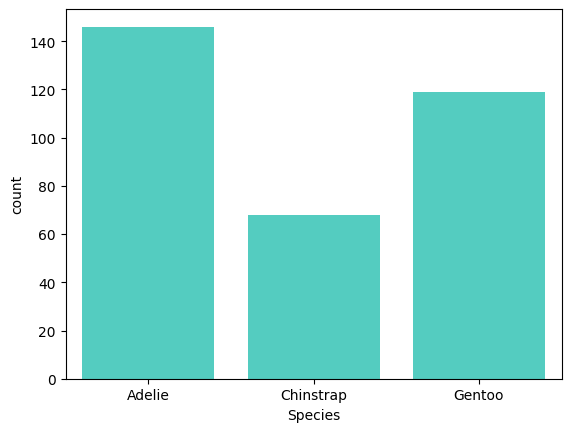

Seaborn plots exploration

```python
import pandas as pd
import numpy as np
from matplotlib import pyplot as plt
import seaborn as sns
```

#### Relational Plots
These plots show relationships between two or more variables.
- scatterplot: *sns.scatterplot()*

relplot: A figure-level function for creating scatter and line plots.

```python
movies = pd.read_csv('/home/annie/Python/data/MoviesOnStreamingPlatforms.csv')
movies.head()
```

<div>
<style scoped>
    .dataframe tbody tr th:only-of-type {
        vertical-align: middle;
    }

    .dataframe tbody tr th {
        vertical-align: top;
    }

    .dataframe thead th {
        text-align: right;
    }
</style>
<table border="1" class="dataframe">
  <thead>
    <tr style="text-align: right;">
      <th></th>
      <th>Unnamed: 0</th>
      <th>ID</th>
      <th>Title</th>
      <th>Year</th>
      <th>Age</th>
      <th>Rotten Tomatoes</th>
      <th>Netflix</th>
      <th>Hulu</th>
      <th>Prime Video</th>
      <th>Disney+</th>
      <th>Type</th>
    </tr>
  </thead>
  <tbody>
    <tr>
      <th>0</th>
      <td>0</td>
      <td>1</td>
      <td>The Irishman</td>
      <td>2019</td>
      <td>18+</td>
      <td>98/100</td>
      <td>1</td>
      <td>0</td>
      <td>0</td>
      <td>0</td>
      <td>0</td>
    </tr>
    <tr>
      <th>1</th>
      <td>1</td>
      <td>2</td>
      <td>Dangal</td>
      <td>2016</td>
      <td>7+</td>
      <td>97/100</td>
      <td>1</td>
      <td>0</td>
      <td>0</td>
      <td>0</td>
      <td>0</td>
    </tr>
    <tr>
      <th>2</th>
      <td>2</td>
      <td>3</td>
      <td>David Attenborough: A Life on Our Planet</td>
      <td>2020</td>
      <td>7+</td>
      <td>95/100</td>
      <td>1</td>
      <td>0</td>
      <td>0</td>
      <td>0</td>
      <td>0</td>
    </tr>
    <tr>
      <th>3</th>
      <td>3</td>
      <td>4</td>
      <td>Lagaan: Once Upon a Time in India</td>
      <td>2001</td>
      <td>7+</td>
      <td>94/100</td>
      <td>1</td>
      <td>0</td>
      <td>0</td>
      <td>0</td>
      <td>0</td>
    </tr>
    <tr>
      <th>4</th>
      <td>4</td>
      <td>5</td>
      <td>Roma</td>
      <td>2018</td>
      <td>18+</td>
      <td>94/100</td>
      <td>1</td>
      <td>0</td>
      <td>0</td>
      <td>0</td>
      <td>0</td>
    </tr>
  </tbody>
</table>
</div>

```python
movies.info()
```

    <class 'pandas.core.frame.DataFrame'>
    RangeIndex: 9515 entries, 0 to 9514
    Data columns (total 11 columns):
     #   Column           Non-Null Count  Dtype 
    ---  ------           --------------  ----- 
     0   Unnamed: 0       9515 non-null   int64 
     1   ID               9515 non-null   int64 
     2   Title            9515 non-null   object
     3   Year             9515 non-null   int64 
     4   Age              5338 non-null   object
     5   Rotten Tomatoes  9508 non-null   object
     6   Netflix          9515 non-null   int64 
     7   Hulu             9515 non-null   int64 
     8   Prime Video      9515 non-null   int64 
     9   Disney+          9515 non-null   int64 
     10  Type             9515 non-null   int64 
    dtypes: int64(8), object(3)
    memory usage: 817.8+ KB

```python
movie_ratings_df = movies.copy().drop(columns=['Unnamed: 0', 'ID'])
movie_ratings_df['ratings'] = movie_ratings_df['Rotten Tomatoes'].str.replace('/100', '').fillna('0').astype(int)
movie_ratings_df.head()
# movie_ratings_df[movie_ratings_df['ratings'] == '0']
```

<div>
<style scoped>
    .dataframe tbody tr th:only-of-type {
        vertical-align: middle;
    }

    .dataframe tbody tr th {
        vertical-align: top;
    }

    .dataframe thead th {
        text-align: right;
    }
</style>
<table border="1" class="dataframe">
  <thead>
    <tr style="text-align: right;">
      <th></th>
      <th>Title</th>
      <th>Year</th>
      <th>Age</th>
      <th>Rotten Tomatoes</th>
      <th>Netflix</th>
      <th>Hulu</th>
      <th>Prime Video</th>
      <th>Disney+</th>
      <th>Type</th>
      <th>ratings</th>
    </tr>
  </thead>
  <tbody>
    <tr>
      <th>0</th>
      <td>The Irishman</td>
      <td>2019</td>
      <td>18+</td>
      <td>98/100</td>
      <td>1</td>
      <td>0</td>
      <td>0</td>
      <td>0</td>
      <td>0</td>
      <td>98</td>
    </tr>
    <tr>
      <th>1</th>
      <td>Dangal</td>
      <td>2016</td>
      <td>7+</td>
      <td>97/100</td>
      <td>1</td>
      <td>0</td>
      <td>0</td>
      <td>0</td>
      <td>0</td>
      <td>97</td>
    </tr>
    <tr>
      <th>2</th>
      <td>David Attenborough: A Life on Our Planet</td>
      <td>2020</td>
      <td>7+</td>
      <td>95/100</td>
      <td>1</td>
      <td>0</td>
      <td>0</td>
      <td>0</td>
      <td>0</td>
      <td>95</td>
    </tr>
    <tr>
      <th>3</th>
      <td>Lagaan: Once Upon a Time in India</td>
      <td>2001</td>
      <td>7+</td>
      <td>94/100</td>
      <td>1</td>
      <td>0</td>
      <td>0</td>
      <td>0</td>
      <td>0</td>
      <td>94</td>
    </tr>
    <tr>
      <th>4</th>
      <td>Roma</td>
      <td>2018</td>
      <td>18+</td>
      <td>94/100</td>
      <td>1</td>
      <td>0</td>
      <td>0</td>
      <td>0</td>
      <td>0</td>
      <td>94</td>
    </tr>
  </tbody>
</table>
</div>

```python
# movie_ratings_df.info()
```

```python
disney_df = movie_ratings_df.copy().drop(columns=['Netflix', 'Hulu', 'Prime Video'])
disney_df = disney_df[disney_df['Disney+'] == 1]
```

```python
disney_df.head()
```

<div>
<style scoped>
    .dataframe tbody tr th:only-of-type {
        vertical-align: middle;
    }

    .dataframe tbody tr th {
        vertical-align: top;
    }

    .dataframe thead th {
        text-align: right;
    }
</style>
<table border="1" class="dataframe">
  <thead>
    <tr style="text-align: right;">
      <th></th>
      <th>Title</th>
      <th>Year</th>
      <th>Age</th>
      <th>Rotten Tomatoes</th>
      <th>Disney+</th>
      <th>Type</th>
      <th>ratings</th>
    </tr>
  </thead>
  <tbody>
    <tr>
      <th>270</th>
      <td>White Fang</td>
      <td>2018</td>
      <td>7+</td>
      <td>76/100</td>
      <td>1</td>
      <td>0</td>
      <td>76</td>
    </tr>
    <tr>
      <th>712</th>
      <td>Muppets Most Wanted</td>
      <td>2014</td>
      <td>7+</td>
      <td>67/100</td>
      <td>1</td>
      <td>0</td>
      <td>67</td>
    </tr>
    <tr>
      <th>1330</th>
      <td>Zapped</td>
      <td>2014</td>
      <td>all</td>
      <td>59/100</td>
      <td>1</td>
      <td>0</td>
      <td>59</td>
    </tr>
    <tr>
      <th>1813</th>
      <td>The Blue Umbrella</td>
      <td>2005</td>
      <td>NaN</td>
      <td>54/100</td>
      <td>1</td>
      <td>0</td>
      <td>54</td>
    </tr>
    <tr>
      <th>2029</th>
      <td>Sky High</td>
      <td>2020</td>
      <td>NaN</td>
      <td>51/100</td>
      <td>1</td>
      <td>0</td>
      <td>51</td>
    </tr>
  </tbody>
</table>
</div>

```python
plt.figure(figsize=(10, 6))
sns.scatterplot(x='Year', 
                y='ratings', 
                color='hotpink',
                data=disney_df)
plt.title('Rotten Tomatoes rating for Disney movies by year')
plt.ylabel('Ratings out of 100')
plt.yticks(ticks=range(0,100,5))
plt.xticks(ticks=range(1920, 2024, 10))

#using regplot to add a regression line

# sns.regplot(x='Year', 
#             y='ratings', 
#             data=disney_df,
#             scatter=False, # Disable scatter points to avoid duplicate points
#             color='skyblue')
# plt.ylabel('Ratings out of 100')
# plt.yticks(ticks=range(0,100,5))
plt.show()
```

    

    

```python
disney_df[disney_df['ratings']<20].sort_values(by='Year', ascending=False)
```

<div>
<style scoped>
    .dataframe tbody tr th:only-of-type {
        vertical-align: middle;
    }

    .dataframe tbody tr th {
        vertical-align: top;
    }

    .dataframe thead th {
        text-align: right;
    }
</style>
<table border="1" class="dataframe">
  <thead>
    <tr style="text-align: right;">
      <th></th>
      <th>Title</th>
      <th>Year</th>
      <th>Age</th>
      <th>Rotten Tomatoes</th>
      <th>Disney+</th>
      <th>Type</th>
      <th>ratings</th>
    </tr>
  </thead>
  <tbody>
    <tr>
      <th>9503</th>
      <td>Disney My Music Story: Sukima Switch</td>
      <td>2021</td>
      <td>16+</td>
      <td>16/100</td>
      <td>1</td>
      <td>0</td>
      <td>16</td>
    </tr>
    <tr>
      <th>9509</th>
      <td>Built for Mars: The Perseverance Rover</td>
      <td>2021</td>
      <td>NaN</td>
      <td>14/100</td>
      <td>1</td>
      <td>0</td>
      <td>14</td>
    </tr>
    <tr>
      <th>9502</th>
      <td>Sharkcano</td>
      <td>2020</td>
      <td>NaN</td>
      <td>16/100</td>
      <td>1</td>
      <td>0</td>
      <td>16</td>
    </tr>
    <tr>
      <th>9507</th>
      <td>Texas Storm Squad</td>
      <td>2020</td>
      <td>13+</td>
      <td>14/100</td>
      <td>1</td>
      <td>0</td>
      <td>14</td>
    </tr>
    <tr>
      <th>9508</th>
      <td>What the Shark?</td>
      <td>2020</td>
      <td>13+</td>
      <td>14/100</td>
      <td>1</td>
      <td>0</td>
      <td>14</td>
    </tr>
    <tr>
      <th>9510</th>
      <td>Most Wanted Sharks</td>
      <td>2020</td>
      <td>NaN</td>
      <td>14/100</td>
      <td>1</td>
      <td>0</td>
      <td>14</td>
    </tr>
    <tr>
      <th>9511</th>
      <td>Doc McStuffins: The Doc Is In</td>
      <td>2020</td>
      <td>NaN</td>
      <td>13/100</td>
      <td>1</td>
      <td>0</td>
      <td>13</td>
    </tr>
    <tr>
      <th>9505</th>
      <td>Great Shark Chow Down</td>
      <td>2019</td>
      <td>7+</td>
      <td>14/100</td>
      <td>1</td>
      <td>0</td>
      <td>14</td>
    </tr>
    <tr>
      <th>9512</th>
      <td>Ultimate Viking Sword</td>
      <td>2019</td>
      <td>NaN</td>
      <td>13/100</td>
      <td>1</td>
      <td>0</td>
      <td>13</td>
    </tr>
    <tr>
      <th>9514</th>
      <td>Women of Impact: Changing the World</td>
      <td>2019</td>
      <td>7+</td>
      <td>10/100</td>
      <td>1</td>
      <td>0</td>
      <td>10</td>
    </tr>
    <tr>
      <th>9504</th>
      <td>Big Cat Games</td>
      <td>2015</td>
      <td>NaN</td>
      <td>15/100</td>
      <td>1</td>
      <td>0</td>
      <td>15</td>
    </tr>
    <tr>
      <th>9513</th>
      <td>Hunt for the Abominable Snowman</td>
      <td>2011</td>
      <td>NaN</td>
      <td>10/100</td>
      <td>1</td>
      <td>0</td>
      <td>10</td>
    </tr>
    <tr>
      <th>9506</th>
      <td>In Beaver Valley</td>
      <td>1950</td>
      <td>NaN</td>
      <td>14/100</td>
      <td>1</td>
      <td>0</td>
      <td>14</td>
    </tr>
  </tbody>
</table>
</div>

#### Regression line
- trends --> visual representaion of the relationship between x and y
- can be used to predict future values
- summarises the overall direction and strength of the relationship
- identifies outliers

```python
# Using sns.lmplot
sns.lmplot(x='Year', 
                y='ratings', 
                height=6,
                aspect=1.5,
                data=disney_df,
                scatter_kws={'color': 'turquoise'},
                line_kws={'color': 'hotpink'})  # Change the color of the regression line

plt.title('Rotten Tomatoes rating for Disney movies by year')
plt.ylabel('Ratings out of 100')
plt.yticks(ticks=range(0,105,5))
plt.xticks(ticks=range(1920, 2024, 10))
plt.show()
```

    

    

- Regression Line: represents the trend of the data. The shaded area around the line represents the confidence interval, indicating the uncertainty of the regression estimate.
- The regression line is relatively flat, suggesting that there is no strong trend in the ratings over time. This implies that the average Rotten Tomatoes rating for Disney movies has remained relatively stable over the decades.
- There is significant variability in the ratings, especially in recent years (from the 1990s onwards), indicating that Disney has released movies with both very high and very low ratings.
Earlier years (1930s to 1950s) show fewer movies, with a tendency towards lower ratings compared to later years.
- Recent Years: The dense clustering of data points in recent years indicates that Disney has released a higher number of movies. The ratings for these movies vary widely, but there is no clear upward or downward trend in average ratings.
- Flat Regression Line: The lack of a strong slope in the regression line suggests that, on average, Disney movies' Rotten Tomatoes ratings have not significantly improved or declined over time.
- High Variability: The wide spread of points indicates that Disney has produced a diverse range of movies, with some receiving very high ratings and others very low ratings, particularly in recent decades.

#### Categorical Plots
These plots are used to show the distribution of data across different categories.
- stripplot: *sns.stripplot()*
- swarmplot: *sns.swarmplot()*
- boxplot: *sns.boxplot()*
- boxenplot (an enhanced box plot): *sns.boxenplot()* 
- violinplot: *sns.violinplot()*

catplot: A figure-level function for creating categorical plots.

```python
penguin_lter = pd.read_csv('/home/annie/Python/data/penguins_lter.csv')
penguin_df = penguin_lter.dropna(subset=['Sex']) #drop NaNs from Sex column
penguin_df = penguin_df.drop(columns=['Sample Number', 'Individual ID', 'Stage', 'Clutch Completion', 'Clutch Completion', 'Date Egg', 'Comments'])
penguin_df = penguin_df[penguin_df['Sex'] != '.']
penguin_df.head()

# penguin_df.info()
```

<div>
<style scoped>
    .dataframe tbody tr th:only-of-type {
        vertical-align: middle;
    }

    .dataframe tbody tr th {
        vertical-align: top;
    }

    .dataframe thead th {
        text-align: right;
    }
</style>
<table border="1" class="dataframe">
  <thead>
    <tr style="text-align: right;">
      <th></th>
      <th>studyName</th>
      <th>Species</th>
      <th>Region</th>
      <th>Island</th>
      <th>Culmen Length (mm)</th>
      <th>Culmen Depth (mm)</th>
      <th>Flipper Length (mm)</th>
      <th>Body Mass (g)</th>
      <th>Sex</th>
      <th>Delta 15 N (o/oo)</th>
      <th>Delta 13 C (o/oo)</th>
    </tr>
  </thead>
  <tbody>
    <tr>
      <th>0</th>
      <td>PAL0708</td>
      <td>Adelie Penguin (Pygoscelis adeliae)</td>
      <td>Anvers</td>
      <td>Torgersen</td>
      <td>39.1</td>
      <td>18.7</td>
      <td>181.0</td>
      <td>3750.0</td>
      <td>MALE</td>
      <td>NaN</td>
      <td>NaN</td>
    </tr>
    <tr>
      <th>1</th>
      <td>PAL0708</td>
      <td>Adelie Penguin (Pygoscelis adeliae)</td>
      <td>Anvers</td>
      <td>Torgersen</td>
      <td>39.5</td>
      <td>17.4</td>
      <td>186.0</td>
      <td>3800.0</td>
      <td>FEMALE</td>
      <td>8.94956</td>
      <td>-24.69454</td>
    </tr>
    <tr>
      <th>2</th>
      <td>PAL0708</td>
      <td>Adelie Penguin (Pygoscelis adeliae)</td>
      <td>Anvers</td>
      <td>Torgersen</td>
      <td>40.3</td>
      <td>18.0</td>
      <td>195.0</td>
      <td>3250.0</td>
      <td>FEMALE</td>
      <td>8.36821</td>
      <td>-25.33302</td>
    </tr>
    <tr>
      <th>4</th>
      <td>PAL0708</td>
      <td>Adelie Penguin (Pygoscelis adeliae)</td>
      <td>Anvers</td>
      <td>Torgersen</td>
      <td>36.7</td>
      <td>19.3</td>
      <td>193.0</td>
      <td>3450.0</td>
      <td>FEMALE</td>
      <td>8.76651</td>
      <td>-25.32426</td>
    </tr>
    <tr>
      <th>5</th>
      <td>PAL0708</td>
      <td>Adelie Penguin (Pygoscelis adeliae)</td>
      <td>Anvers</td>
      <td>Torgersen</td>
      <td>39.3</td>
      <td>20.6</td>
      <td>190.0</td>
      <td>3650.0</td>
      <td>MALE</td>
      <td>8.66496</td>
      <td>-25.29805</td>
    </tr>
  </tbody>
</table>
</div>

```python
# penguin_lter['Clutch Completion'].unique()
# penguin_lter['studyName'].unique()
# penguin_lter['Date Egg'].unique()
# penguin_lter['Stage'].unique()
```

```python
# penguin_clean[penguin_clean['Sex']=='.']
penguin_df.head()
```

<div>
<style scoped>
    .dataframe tbody tr th:only-of-type {
        vertical-align: middle;
    }

    .dataframe tbody tr th {
        vertical-align: top;
    }

    .dataframe thead th {
        text-align: right;
    }
</style>
<table border="1" class="dataframe">
  <thead>
    <tr style="text-align: right;">
      <th></th>
      <th>studyName</th>
      <th>Species</th>
      <th>Region</th>
      <th>Island</th>
      <th>Culmen Length (mm)</th>
      <th>Culmen Depth (mm)</th>
      <th>Flipper Length (mm)</th>
      <th>Body Mass (g)</th>
      <th>Sex</th>
      <th>Delta 15 N (o/oo)</th>
      <th>Delta 13 C (o/oo)</th>
    </tr>
  </thead>
  <tbody>
    <tr>
      <th>0</th>
      <td>PAL0708</td>
      <td>Adelie Penguin (Pygoscelis adeliae)</td>
      <td>Anvers</td>
      <td>Torgersen</td>
      <td>39.1</td>
      <td>18.7</td>
      <td>181.0</td>
      <td>3750.0</td>
      <td>MALE</td>
      <td>NaN</td>
      <td>NaN</td>
    </tr>
    <tr>
      <th>1</th>
      <td>PAL0708</td>
      <td>Adelie Penguin (Pygoscelis adeliae)</td>
      <td>Anvers</td>
      <td>Torgersen</td>
      <td>39.5</td>
      <td>17.4</td>
      <td>186.0</td>
      <td>3800.0</td>
      <td>FEMALE</td>
      <td>8.94956</td>
      <td>-24.69454</td>
    </tr>
    <tr>
      <th>2</th>
      <td>PAL0708</td>
      <td>Adelie Penguin (Pygoscelis adeliae)</td>
      <td>Anvers</td>
      <td>Torgersen</td>
      <td>40.3</td>
      <td>18.0</td>
      <td>195.0</td>
      <td>3250.0</td>
      <td>FEMALE</td>
      <td>8.36821</td>
      <td>-25.33302</td>
    </tr>
    <tr>
      <th>4</th>
      <td>PAL0708</td>
      <td>Adelie Penguin (Pygoscelis adeliae)</td>
      <td>Anvers</td>
      <td>Torgersen</td>
      <td>36.7</td>
      <td>19.3</td>
      <td>193.0</td>
      <td>3450.0</td>
      <td>FEMALE</td>
      <td>8.76651</td>
      <td>-25.32426</td>
    </tr>
    <tr>
      <th>5</th>
      <td>PAL0708</td>
      <td>Adelie Penguin (Pygoscelis adeliae)</td>
      <td>Anvers</td>
      <td>Torgersen</td>
      <td>39.3</td>
      <td>20.6</td>
      <td>190.0</td>
      <td>3650.0</td>
      <td>MALE</td>
      <td>8.66496</td>
      <td>-25.29805</td>
    </tr>
  </tbody>
</table>
</div>

```python
penguin_df.sample(5)
```

<div>
<style scoped>
    .dataframe tbody tr th:only-of-type {
        vertical-align: middle;
    }

    .dataframe tbody tr th {
        vertical-align: top;
    }

    .dataframe thead th {
        text-align: right;
    }
</style>
<table border="1" class="dataframe">
  <thead>
    <tr style="text-align: right;">
      <th></th>
      <th>studyName</th>
      <th>Species</th>
      <th>Region</th>
      <th>Island</th>
      <th>Culmen Length (mm)</th>
      <th>Culmen Depth (mm)</th>
      <th>Flipper Length (mm)</th>
      <th>Body Mass (g)</th>
      <th>Sex</th>
      <th>Delta 15 N (o/oo)</th>
      <th>Delta 13 C (o/oo)</th>
    </tr>
  </thead>
  <tbody>
    <tr>
      <th>309</th>
      <td>PAL0910</td>
      <td>Gentoo penguin (Pygoscelis papua)</td>
      <td>Anvers</td>
      <td>Biscoe</td>
      <td>52.1</td>
      <td>17.0</td>
      <td>230.0</td>
      <td>5550.0</td>
      <td>MALE</td>
      <td>8.27595</td>
      <td>-26.11657</td>
    </tr>
    <tr>
      <th>294</th>
      <td>PAL0809</td>
      <td>Gentoo penguin (Pygoscelis papua)</td>
      <td>Anvers</td>
      <td>Biscoe</td>
      <td>46.4</td>
      <td>15.0</td>
      <td>216.0</td>
      <td>4700.0</td>
      <td>FEMALE</td>
      <td>8.47938</td>
      <td>-26.95470</td>
    </tr>
    <tr>
      <th>50</th>
      <td>PAL0809</td>
      <td>Adelie Penguin (Pygoscelis adeliae)</td>
      <td>Anvers</td>
      <td>Biscoe</td>
      <td>39.6</td>
      <td>17.7</td>
      <td>186.0</td>
      <td>3500.0</td>
      <td>FEMALE</td>
      <td>8.46616</td>
      <td>-26.12989</td>
    </tr>
    <tr>
      <th>157</th>
      <td>PAL0708</td>
      <td>Chinstrap penguin (Pygoscelis antarctica)</td>
      <td>Anvers</td>
      <td>Dream</td>
      <td>45.2</td>
      <td>17.8</td>
      <td>198.0</td>
      <td>3950.0</td>
      <td>FEMALE</td>
      <td>8.88942</td>
      <td>-24.49433</td>
    </tr>
    <tr>
      <th>111</th>
      <td>PAL0910</td>
      <td>Adelie Penguin (Pygoscelis adeliae)</td>
      <td>Anvers</td>
      <td>Biscoe</td>
      <td>45.6</td>
      <td>20.3</td>
      <td>191.0</td>
      <td>4600.0</td>
      <td>MALE</td>
      <td>8.65466</td>
      <td>-26.32909</td>
    </tr>
  </tbody>
</table>
</div>

```python
penguin_df['Sex'].unique()
```

    array(['MALE', 'FEMALE'], dtype=object)

```python
#penguin_df

sns.boxplot(data=penguin_df, x='Species', y='Body Mass (g)', palette='mako', hue='Species')
plt.xticks(rotation=45)  
plt.xticks(ticks=[0, 1, 2], labels=['Adelie', 'Chinstrap', 'Gentoo']) # rename ticker labels
plt.title('Body Mass Distribution by species')
plt.show()
```

    

    

```python
sns.boxenplot(data=penguin_df, x='Sex', y='Body Mass (g)', palette='viridis', hue='Sex')
plt.xticks(rotation=45)  
plt.title('Body Mass Distribution by sex')
plt.show()
```

    

    

```python
# #disney_df
# sns.boxplot(x=disney_df['ratings'])
# plt.show()

# sns.boxenplot(x=disney_df['ratings'])
# plt.show()
```

```python
sns.violinplot(data=penguin_df, x='Species', y='Culmen Length (mm)', hue='Sex', palette='mako')
plt.xticks(ticks=[0, 1, 2], labels=['Adelie', 'Chinstrap', 'Gentoo']) # rename ticker labels
plt.legend(loc="upper left")
plt.title('Culmen Length Distribution by species and sex')
plt.show()
```

    

    

```python
# sns.stripplot(x=disney_df['ratings'])
# plt.show()

sns.stripplot(x='Culmen Depth (mm)', y='Species', hue='Species', data=penguin_df)
plt.yticks(ticks=[0, 1, 2], labels=['Adelie', 'Chinstrap', 'Gentoo'])
plt.title('Culmen Depth Distribution by species')
plt.show()
```

    

    

```python
# sns.swarmplot(x=disney_df['ratings'])
# plt.show()

sns.swarmplot(x='Flipper Length (mm)',y='Species', hue='Species', data=penguin_df)
plt.yticks(ticks=[0, 1, 2], labels=['Adelie', 'Chinstrap', 'Gentoo'])
plt.title('Flipper Length Distribution by species')
plt.show()
```

    

    

#### Distribution Plots
These plots show the distribution of a single variable.
- histplot (aka histogram): *sns.histplot()*
- kdeplot (Kernel Density Estimate plot): *sns.kdeplot()* 
- ecdfplot (Empirical Cumulative Distribution Function): *sns.ecdfplot()*

displot: A figure-level function for creating histograms and KDE plots.

```python
disney_df.head(2)
```

<div>
<style scoped>
    .dataframe tbody tr th:only-of-type {
        vertical-align: middle;
    }

    .dataframe tbody tr th {
        vertical-align: top;
    }

    .dataframe thead th {
        text-align: right;
    }
</style>
<table border="1" class="dataframe">
  <thead>
    <tr style="text-align: right;">
      <th></th>
      <th>Title</th>
      <th>Year</th>
      <th>Age</th>
      <th>Rotten Tomatoes</th>
      <th>Disney+</th>
      <th>Type</th>
      <th>ratings</th>
    </tr>
  </thead>
  <tbody>
    <tr>
      <th>270</th>
      <td>White Fang</td>
      <td>2018</td>
      <td>7+</td>
      <td>76/100</td>
      <td>1</td>
      <td>0</td>
      <td>76</td>
    </tr>
    <tr>
      <th>712</th>
      <td>Muppets Most Wanted</td>
      <td>2014</td>
      <td>7+</td>
      <td>67/100</td>
      <td>1</td>
      <td>0</td>
      <td>67</td>
    </tr>
  </tbody>
</table>
</div>

```python
penguin_df.head(2)
# penguin_df['Island'].unique()
```

<div>
<style scoped>
    .dataframe tbody tr th:only-of-type {
        vertical-align: middle;
    }

    .dataframe tbody tr th {
        vertical-align: top;
    }

    .dataframe thead th {
        text-align: right;
    }
</style>
<table border="1" class="dataframe">
  <thead>
    <tr style="text-align: right;">
      <th></th>
      <th>studyName</th>
      <th>Species</th>
      <th>Region</th>
      <th>Island</th>
      <th>Culmen Length (mm)</th>
      <th>Culmen Depth (mm)</th>
      <th>Flipper Length (mm)</th>
      <th>Body Mass (g)</th>
      <th>Sex</th>
      <th>Delta 15 N (o/oo)</th>
      <th>Delta 13 C (o/oo)</th>
    </tr>
  </thead>
  <tbody>
    <tr>
      <th>0</th>
      <td>PAL0708</td>
      <td>Adelie Penguin (Pygoscelis adeliae)</td>
      <td>Anvers</td>
      <td>Torgersen</td>
      <td>39.1</td>
      <td>18.7</td>
      <td>181.0</td>
      <td>3750.0</td>
      <td>MALE</td>
      <td>NaN</td>
      <td>NaN</td>
    </tr>
    <tr>
      <th>1</th>
      <td>PAL0708</td>
      <td>Adelie Penguin (Pygoscelis adeliae)</td>
      <td>Anvers</td>
      <td>Torgersen</td>
      <td>39.5</td>
      <td>17.4</td>
      <td>186.0</td>
      <td>3800.0</td>
      <td>FEMALE</td>
      <td>8.94956</td>
      <td>-24.69454</td>
    </tr>
  </tbody>
</table>
</div>

```python
sns.histplot(disney_df, x='Year', 
             kde=True, 
             color='hotpink')
plt.title('Distribution of Disney Movies between 1920-2020')
plt.show()
```

    

    

```python
sns.kdeplot(disney_df, x='Year', color='hotpink')
plt.show()
```

    

    

```python
sns.histplot(data=penguin_df, x='Body Mass (g)')
plt.show()
```

    

    

```python
sns.kdeplot(x=disney_df['ratings']) #'Year'
plt.show()
```

    

    

```python
sns.ecdfplot(x=disney_df['ratings'])
plt.show()
```

    

    

#### Matrix Plots
These plots are used to visualize data in matrix form.
- heatmap: *sns.heatmap()*
- clustermap (hierarchically-clustered heatmap): *sns.clustermap()*

```python
adelie_matrix = penguin_df[penguin_df['Species']=='Adelie Penguin (Pygoscelis adeliae)']
adelie_matrix = adelie_matrix.drop(columns=['Species','studyName', 'Region', 'Island', 'Sex', 'Delta 15 N (o/oo)', 'Delta 13 C (o/oo)'])
```

```python
adelie_matrix.head()
```

<div>
<style scoped>
    .dataframe tbody tr th:only-of-type {
        vertical-align: middle;
    }

    .dataframe tbody tr th {
        vertical-align: top;
    }

    .dataframe thead th {
        text-align: right;
    }
</style>
<table border="1" class="dataframe">
  <thead>
    <tr style="text-align: right;">
      <th></th>
      <th>Culmen Length (mm)</th>
      <th>Culmen Depth (mm)</th>
      <th>Flipper Length (mm)</th>
      <th>Body Mass (g)</th>
    </tr>
  </thead>
  <tbody>
    <tr>
      <th>0</th>
      <td>39.1</td>
      <td>18.7</td>
      <td>181.0</td>
      <td>3750.0</td>
    </tr>
    <tr>
      <th>1</th>
      <td>39.5</td>
      <td>17.4</td>
      <td>186.0</td>
      <td>3800.0</td>
    </tr>
    <tr>
      <th>2</th>
      <td>40.3</td>
      <td>18.0</td>
      <td>195.0</td>
      <td>3250.0</td>
    </tr>
    <tr>
      <th>4</th>
      <td>36.7</td>
      <td>19.3</td>
      <td>193.0</td>
      <td>3450.0</td>
    </tr>
    <tr>
      <th>5</th>
      <td>39.3</td>
      <td>20.6</td>
      <td>190.0</td>
      <td>3650.0</td>
    </tr>
  </tbody>
</table>
</div>

```python
# sns.heatmap(df)
plt.figure(figsize=(8, 6))
sns.heatmap(adelie_matrix.corr(), cmap='mako_r')
plt.title('Correlation Heatmap of Adelie Penguin Measurements')
plt.show()
```

    

    

#### Multi-Plot Grids
These are used for plotting multiple plots in a grid layout.
- FacetGrid: *sns.FacetGrid()*
- PairGrid: *sns.PairGrid()*
- pairplot: *sns.pairplot()*

```python
penguins = sns.load_dataset('penguins')
penguins.head()
```

<div>
<style scoped>
    .dataframe tbody tr th:only-of-type {
        vertical-align: middle;
    }

    .dataframe tbody tr th {
        vertical-align: top;
    }

    .dataframe thead th {
        text-align: right;
    }
</style>
<table border="1" class="dataframe">
  <thead>
    <tr style="text-align: right;">
      <th></th>
      <th>species</th>
      <th>island</th>
      <th>bill_length_mm</th>
      <th>bill_depth_mm</th>
      <th>flipper_length_mm</th>
      <th>body_mass_g</th>
      <th>sex</th>
    </tr>
  </thead>
  <tbody>
    <tr>
      <th>0</th>
      <td>Adelie</td>
      <td>Torgersen</td>
      <td>39.1</td>
      <td>18.7</td>
      <td>181.0</td>
      <td>3750.0</td>
      <td>Male</td>
    </tr>
    <tr>
      <th>1</th>
      <td>Adelie</td>
      <td>Torgersen</td>
      <td>39.5</td>
      <td>17.4</td>
      <td>186.0</td>
      <td>3800.0</td>
      <td>Female</td>
    </tr>
    <tr>
      <th>2</th>
      <td>Adelie</td>
      <td>Torgersen</td>
      <td>40.3</td>
      <td>18.0</td>
      <td>195.0</td>
      <td>3250.0</td>
      <td>Female</td>
    </tr>
    <tr>
      <th>3</th>
      <td>Adelie</td>
      <td>Torgersen</td>
      <td>NaN</td>
      <td>NaN</td>
      <td>NaN</td>
      <td>NaN</td>
      <td>NaN</td>
    </tr>
    <tr>
      <th>4</th>
      <td>Adelie</td>
      <td>Torgersen</td>
      <td>36.7</td>
      <td>19.3</td>
      <td>193.0</td>
      <td>3450.0</td>
      <td>Female</td>
    </tr>
  </tbody>
</table>
</div>

```python
peng = sns.FacetGrid(penguins, col='species', #creates separate columns for each unique value in the Species column
                     row='sex', hue='sex', palette="mako_r", sharex=False)
peng.map(sns.histplot, 'bill_length_mm')
# plt.xticks(ticks=[0, 1, 2], labels=['Adelie', 'Chinstrap', 'Gentoo'])

plt.show()
```

    

    

```python
penguin_df.head(2)
```

<div>
<style scoped>
    .dataframe tbody tr th:only-of-type {
        vertical-align: middle;
    }

    .dataframe tbody tr th {
        vertical-align: top;
    }

    .dataframe thead th {
        text-align: right;
    }
</style>
<table border="1" class="dataframe">
  <thead>
    <tr style="text-align: right;">
      <th></th>
      <th>studyName</th>
      <th>Species</th>
      <th>Region</th>
      <th>Island</th>
      <th>Culmen Length (mm)</th>
      <th>Culmen Depth (mm)</th>
      <th>Flipper Length (mm)</th>
      <th>Body Mass (g)</th>
      <th>Sex</th>
      <th>Delta 15 N (o/oo)</th>
      <th>Delta 13 C (o/oo)</th>
    </tr>
  </thead>
  <tbody>
    <tr>
      <th>0</th>
      <td>PAL0708</td>
      <td>Adelie Penguin (Pygoscelis adeliae)</td>
      <td>Anvers</td>
      <td>Torgersen</td>
      <td>39.1</td>
      <td>18.7</td>
      <td>181.0</td>
      <td>3750.0</td>
      <td>MALE</td>
      <td>NaN</td>
      <td>NaN</td>
    </tr>
    <tr>
      <th>1</th>
      <td>PAL0708</td>
      <td>Adelie Penguin (Pygoscelis adeliae)</td>
      <td>Anvers</td>
      <td>Torgersen</td>
      <td>39.5</td>
      <td>17.4</td>
      <td>186.0</td>
      <td>3800.0</td>
      <td>FEMALE</td>
      <td>8.94956</td>
      <td>-24.69454</td>
    </tr>
  </tbody>
</table>
</div>

```python
sns.pairplot(x_vars = ['Culmen Length (mm)', 'Culmen Depth (mm)', 'Flipper Length (mm)', 'Body Mass (g)'],
             y_vars = ['Culmen Length (mm)', 'Culmen Depth (mm)', 'Flipper Length (mm)', 'Body Mass (g)'],
             hue = 'Species',
             data = penguin_df)
plt.suptitle('Pairplot of Penguin Measurements by Species', y=1.02)
plt.show()
```

    

    

```python
# sns.PairGrid()
pg = sns.PairGrid(penguin_df,
                 x_vars = ['Culmen Length (mm)', 'Culmen Depth (mm)', 'Flipper Length (mm)', 'Body Mass (g)'],
                 y_vars = ['Culmen Length (mm)', 'Culmen Depth (mm)', 'Flipper Length (mm)', 'Body Mass (g)'],
                 hue='Species',
                 palette='cubehelix')
pg.map(sns.scatterplot)
pg.add_legend()
plt.suptitle('Pair Grid showing Penguin Measurements by Species', y=1.02)

plt.show()
```

    

    

```python
pg2 = sns.PairGrid(penguin_df,
                 x_vars = ['Culmen Length (mm)', 'Culmen Depth (mm)', 'Flipper Length (mm)', 'Body Mass (g)'],
                 y_vars = ['Culmen Length (mm)', 'Culmen Depth (mm)', 'Flipper Length (mm)', 'Body Mass (g)'],
                 hue='Species',
                 palette='cubehelix')
pg2.map_upper(sns.scatterplot)
pg2.map_lower(sns.kdeplot)
pg2.map_diag(sns.histplot)
# pg.add_legend()
# plt.suptitle('Pair Grid showing Penguin Measurements by Species', y=1.02)

plt.show()
```

    

    

#### Joint Plots
These combine univariate and bivariate plots to show relationships between two variables.
- jointplot: *sns.jointplot()*
- JointGrid: *sns.JointGrid()*

```python
iris = sns.load_dataset('iris')
```

```python
iris.sample(5)
```

<div>
<style scoped>
    .dataframe tbody tr th:only-of-type {
        vertical-align: middle;
    }

    .dataframe tbody tr th {
        vertical-align: top;
    }

    .dataframe thead th {
        text-align: right;
    }
</style>
<table border="1" class="dataframe">
  <thead>
    <tr style="text-align: right;">
      <th></th>
      <th>sepal_length</th>
      <th>sepal_width</th>
      <th>petal_length</th>
      <th>petal_width</th>
      <th>species</th>
    </tr>
  </thead>
  <tbody>
    <tr>
      <th>36</th>
      <td>5.5</td>
      <td>3.5</td>
      <td>1.3</td>
      <td>0.2</td>
      <td>setosa</td>
    </tr>
    <tr>
      <th>46</th>
      <td>5.1</td>
      <td>3.8</td>
      <td>1.6</td>
      <td>0.2</td>
      <td>setosa</td>
    </tr>
    <tr>
      <th>52</th>
      <td>6.9</td>
      <td>3.1</td>
      <td>4.9</td>
      <td>1.5</td>
      <td>versicolor</td>
    </tr>
    <tr>
      <th>140</th>
      <td>6.7</td>
      <td>3.1</td>
      <td>5.6</td>
      <td>2.4</td>
      <td>virginica</td>
    </tr>
    <tr>
      <th>106</th>
      <td>4.9</td>
      <td>2.5</td>
      <td>4.5</td>
      <td>1.7</td>
      <td>virginica</td>
    </tr>
  </tbody>
</table>
</div>

```python
iris.info()
```

    <class 'pandas.core.frame.DataFrame'>
    RangeIndex: 150 entries, 0 to 149
    Data columns (total 5 columns):
     #   Column        Non-Null Count  Dtype  
    ---  ------        --------------  -----  
     0   sepal_length  150 non-null    float64
     1   sepal_width   150 non-null    float64
     2   petal_length  150 non-null    float64
     3   petal_width   150 non-null    float64
     4   species       150 non-null    object 
    dtypes: float64(4), object(1)
    memory usage: 6.0+ KB

```python
# sns.jointplot()

ir = sns.jointplot(data=iris, x="sepal_length", y="petal_length", 
              hue='species', 
              palette='husl')
plt.show()
```

    

    

```python
# sns.jointplot()

ir = sns.jointplot(data=iris, x="sepal_length", y="petal_length", kind='hex')
plt.show()
```

    

    

```python
# sns.JointGrid()

ir2 = sns.JointGrid(data=iris, x="sepal_width", y="petal_width",
              hue='species', 
              palette='husl')

ir2.plot(sns.scatterplot, sns.histplot)
plt.show()
```

    

    

```python
# sns.JointGrid()

ir2 = sns.JointGrid(data=iris, x="sepal_width", y="petal_width",
              hue='species')
                   # height=8)

ir2.plot_joint(sns.scatterplot, s=100, palette='husl', marker="+")
ir2.plot_marginals(sns.histplot, kde=True, palette='mako')
plt.show()
```

    

    

#### Time Series Plots
These plots are used to visualise time series data.
- lineplot: *sns.lineplot()* 

```python
disney_df.head(2)
```

<div>
<style scoped>
    .dataframe tbody tr th:only-of-type {
        vertical-align: middle;
    }

    .dataframe tbody tr th {
        vertical-align: top;
    }

    .dataframe thead th {
        text-align: right;
    }
</style>
<table border="1" class="dataframe">
  <thead>
    <tr style="text-align: right;">
      <th></th>
      <th>Title</th>
      <th>Year</th>
      <th>Age</th>
      <th>Rotten Tomatoes</th>
      <th>Disney+</th>
      <th>Type</th>
      <th>ratings</th>
    </tr>
  </thead>
  <tbody>
    <tr>
      <th>270</th>
      <td>White Fang</td>
      <td>2018</td>
      <td>7+</td>
      <td>76/100</td>
      <td>1</td>
      <td>0</td>
      <td>76</td>
    </tr>
    <tr>
      <th>712</th>
      <td>Muppets Most Wanted</td>
      <td>2014</td>
      <td>7+</td>
      <td>67/100</td>
      <td>1</td>
      <td>0</td>
      <td>67</td>
    </tr>
  </tbody>
</table>
</div>

```python
plt.figure(figsize=(8,6))
sns.lineplot(x='Year', 
                y='ratings', 
                data=disney_df,
                color='hotpink')
plt.title('Disney ratings over time')
plt.xticks(ticks=range(1920, 2024, 10)) 
plt.show()
```

    

    

#### Statistical Estimation
These plots are used to show statistical estimates of the data.
- barplot: *sns.barplot()*
- pointplot: *sns.pointplot()*
- countplot: *sns.countplot()*

```python
penguin_df.head(2)
```

<div>
<style scoped>
    .dataframe tbody tr th:only-of-type {
        vertical-align: middle;
    }

    .dataframe tbody tr th {
        vertical-align: top;
    }

    .dataframe thead th {
        text-align: right;
    }
</style>
<table border="1" class="dataframe">
  <thead>
    <tr style="text-align: right;">
      <th></th>
      <th>studyName</th>
      <th>Species</th>
      <th>Region</th>
      <th>Island</th>
      <th>Culmen Length (mm)</th>
      <th>Culmen Depth (mm)</th>
      <th>Flipper Length (mm)</th>
      <th>Body Mass (g)</th>
      <th>Sex</th>
      <th>Delta 15 N (o/oo)</th>
      <th>Delta 13 C (o/oo)</th>
    </tr>
  </thead>
  <tbody>
    <tr>
      <th>0</th>
      <td>PAL0708</td>
      <td>Adelie Penguin (Pygoscelis adeliae)</td>
      <td>Anvers</td>
      <td>Torgersen</td>
      <td>39.1</td>
      <td>18.7</td>
      <td>181.0</td>
      <td>3750.0</td>
      <td>MALE</td>
      <td>NaN</td>
      <td>NaN</td>
    </tr>
    <tr>
      <th>1</th>
      <td>PAL0708</td>
      <td>Adelie Penguin (Pygoscelis adeliae)</td>
      <td>Anvers</td>
      <td>Torgersen</td>
      <td>39.5</td>
      <td>17.4</td>
      <td>186.0</td>
      <td>3800.0</td>
      <td>FEMALE</td>
      <td>8.94956</td>
      <td>-24.69454</td>
    </tr>
  </tbody>
</table>
</div>

```python
adelie = penguin_df[penguin_df['Species']=='Adelie Penguin (Pygoscelis adeliae)']
adelie
```

<div>
<style scoped>
    .dataframe tbody tr th:only-of-type {
        vertical-align: middle;
    }

    .dataframe tbody tr th {
        vertical-align: top;
    }

    .dataframe thead th {
        text-align: right;
    }
</style>
<table border="1" class="dataframe">
  <thead>
    <tr style="text-align: right;">
      <th></th>
      <th>studyName</th>
      <th>Species</th>
      <th>Region</th>
      <th>Island</th>
      <th>Culmen Length (mm)</th>
      <th>Culmen Depth (mm)</th>
      <th>Flipper Length (mm)</th>
      <th>Body Mass (g)</th>
      <th>Sex</th>
      <th>Delta 15 N (o/oo)</th>
      <th>Delta 13 C (o/oo)</th>
    </tr>
  </thead>
  <tbody>
    <tr>
      <th>0</th>
      <td>PAL0708</td>
      <td>Adelie Penguin (Pygoscelis adeliae)</td>
      <td>Anvers</td>
      <td>Torgersen</td>
      <td>39.1</td>
      <td>18.7</td>
      <td>181.0</td>
      <td>3750.0</td>
      <td>MALE</td>
      <td>NaN</td>
      <td>NaN</td>
    </tr>
    <tr>
      <th>1</th>
      <td>PAL0708</td>
      <td>Adelie Penguin (Pygoscelis adeliae)</td>
      <td>Anvers</td>
      <td>Torgersen</td>
      <td>39.5</td>
      <td>17.4</td>
      <td>186.0</td>
      <td>3800.0</td>
      <td>FEMALE</td>
      <td>8.94956</td>
      <td>-24.69454</td>
    </tr>
    <tr>
      <th>2</th>
      <td>PAL0708</td>
      <td>Adelie Penguin (Pygoscelis adeliae)</td>
      <td>Anvers</td>
      <td>Torgersen</td>
      <td>40.3</td>
      <td>18.0</td>
      <td>195.0</td>
      <td>3250.0</td>
      <td>FEMALE</td>
      <td>8.36821</td>
      <td>-25.33302</td>
    </tr>
    <tr>
      <th>4</th>
      <td>PAL0708</td>
      <td>Adelie Penguin (Pygoscelis adeliae)</td>
      <td>Anvers</td>
      <td>Torgersen</td>
      <td>36.7</td>
      <td>19.3</td>
      <td>193.0</td>
      <td>3450.0</td>
      <td>FEMALE</td>
      <td>8.76651</td>
      <td>-25.32426</td>
    </tr>
    <tr>
      <th>5</th>
      <td>PAL0708</td>
      <td>Adelie Penguin (Pygoscelis adeliae)</td>
      <td>Anvers</td>
      <td>Torgersen</td>
      <td>39.3</td>
      <td>20.6</td>
      <td>190.0</td>
      <td>3650.0</td>
      <td>MALE</td>
      <td>8.66496</td>
      <td>-25.29805</td>
    </tr>
    <tr>
      <th>...</th>
      <td>...</td>
      <td>...</td>
      <td>...</td>
      <td>...</td>
      <td>...</td>
      <td>...</td>
      <td>...</td>
      <td>...</td>
      <td>...</td>
      <td>...</td>
      <td>...</td>
    </tr>
    <tr>
      <th>147</th>
      <td>PAL0910</td>
      <td>Adelie Penguin (Pygoscelis adeliae)</td>
      <td>Anvers</td>
      <td>Dream</td>
      <td>36.6</td>
      <td>18.4</td>
      <td>184.0</td>
      <td>3475.0</td>
      <td>FEMALE</td>
      <td>8.68744</td>
      <td>-25.83060</td>
    </tr>
    <tr>
      <th>148</th>
      <td>PAL0910</td>
      <td>Adelie Penguin (Pygoscelis adeliae)</td>
      <td>Anvers</td>
      <td>Dream</td>
      <td>36.0</td>
      <td>17.8</td>
      <td>195.0</td>
      <td>3450.0</td>
      <td>FEMALE</td>
      <td>8.94332</td>
      <td>-25.79189</td>
    </tr>
    <tr>
      <th>149</th>
      <td>PAL0910</td>
      <td>Adelie Penguin (Pygoscelis adeliae)</td>
      <td>Anvers</td>
      <td>Dream</td>
      <td>37.8</td>
      <td>18.1</td>
      <td>193.0</td>
      <td>3750.0</td>
      <td>MALE</td>
      <td>8.97533</td>
      <td>-26.03495</td>
    </tr>
    <tr>
      <th>150</th>
      <td>PAL0910</td>
      <td>Adelie Penguin (Pygoscelis adeliae)</td>
      <td>Anvers</td>
      <td>Dream</td>
      <td>36.0</td>
      <td>17.1</td>
      <td>187.0</td>
      <td>3700.0</td>
      <td>FEMALE</td>
      <td>8.93465</td>
      <td>-26.07081</td>
    </tr>
    <tr>
      <th>151</th>
      <td>PAL0910</td>
      <td>Adelie Penguin (Pygoscelis adeliae)</td>
      <td>Anvers</td>
      <td>Dream</td>
      <td>41.5</td>
      <td>18.5</td>
      <td>201.0</td>
      <td>4000.0</td>
      <td>MALE</td>
      <td>8.89640</td>
      <td>-26.06967</td>
    </tr>
  </tbody>
</table>
<p>146 rows × 11 columns</p>
</div>

```python
sns.barplot(data=penguin_df, x='Species', y='Culmen Length (mm)', color='lavender')
plt.xticks(ticks=[0, 1, 2], labels=['Adelie', 'Chinstrap', 'Gentoo'])
plt.title('Culmen Length of Penguins by species')
plt.show()
```

    

    

```python
sns.barplot(data=penguin_df, x='Species', y='Culmen Length (mm)', hue='Sex', palette='mako')
plt.xticks(ticks=[0, 1, 2], labels=['Adelie', 'Chinstrap', 'Gentoo'])
plt.title('Culmen Length of Penguins by sex and species')
plt.show()
```

    

    

```python
titanic = sns.load_dataset('titanic')
titanic.head()
```

<div>
<style scoped>
    .dataframe tbody tr th:only-of-type {
        vertical-align: middle;
    }

    .dataframe tbody tr th {
        vertical-align: top;
    }

    .dataframe thead th {
        text-align: right;
    }
</style>
<table border="1" class="dataframe">
  <thead>
    <tr style="text-align: right;">
      <th></th>
      <th>survived</th>
      <th>pclass</th>
      <th>sex</th>
      <th>age</th>
      <th>sibsp</th>
      <th>parch</th>
      <th>fare</th>
      <th>embarked</th>
      <th>class</th>
      <th>who</th>
      <th>adult_male</th>
      <th>deck</th>
      <th>embark_town</th>
      <th>alive</th>
      <th>alone</th>
    </tr>
  </thead>
  <tbody>
    <tr>
      <th>0</th>
      <td>0</td>
      <td>3</td>
      <td>male</td>
      <td>22.0</td>
      <td>1</td>
      <td>0</td>
      <td>7.2500</td>
      <td>S</td>
      <td>Third</td>
      <td>man</td>
      <td>True</td>
      <td>NaN</td>
      <td>Southampton</td>
      <td>no</td>
      <td>False</td>
    </tr>
    <tr>
      <th>1</th>
      <td>1</td>
      <td>1</td>
      <td>female</td>
      <td>38.0</td>
      <td>1</td>
      <td>0</td>
      <td>71.2833</td>
      <td>C</td>
      <td>First</td>
      <td>woman</td>
      <td>False</td>
      <td>C</td>
      <td>Cherbourg</td>
      <td>yes</td>
      <td>False</td>
    </tr>
    <tr>
      <th>2</th>
      <td>1</td>
      <td>3</td>
      <td>female</td>
      <td>26.0</td>
      <td>0</td>
      <td>0</td>
      <td>7.9250</td>
      <td>S</td>
      <td>Third</td>
      <td>woman</td>
      <td>False</td>
      <td>NaN</td>
      <td>Southampton</td>
      <td>yes</td>
      <td>True</td>
    </tr>
    <tr>
      <th>3</th>
      <td>1</td>
      <td>1</td>
      <td>female</td>
      <td>35.0</td>
      <td>1</td>
      <td>0</td>
      <td>53.1000</td>
      <td>S</td>
      <td>First</td>
      <td>woman</td>
      <td>False</td>
      <td>C</td>
      <td>Southampton</td>
      <td>yes</td>
      <td>False</td>
    </tr>
    <tr>
      <th>4</th>
      <td>0</td>
      <td>3</td>
      <td>male</td>
      <td>35.0</td>
      <td>0</td>
      <td>0</td>
      <td>8.0500</td>
      <td>S</td>
      <td>Third</td>
      <td>man</td>
      <td>True</td>
      <td>NaN</td>
      <td>Southampton</td>
      <td>no</td>
      <td>True</td>
    </tr>
  </tbody>
</table>
</div>

```python
sns.barplot(data=titanic, x='pclass', y='age', palette='viridis', hue='alive')
plt.title('Passenger Age by Class and Survival Status on the Titanic')
plt.show()
```

    

    

```python
# sns.pointplot()

sns.pointplot(data=penguin_df, x='Species', y='Culmen Length (mm)', hue='Sex', palette='viridis')
plt.xticks(ticks=[0, 1, 2], labels=['Adelie', 'Chinstrap', 'Gentoo'])
plt.show()
```

    

    

```python
# sns.countplot()
sns.countplot(data=penguin_df, x='Species', color='turquoise')
plt.xticks(ticks=[0, 1, 2], labels=['Adelie', 'Chinstrap', 'Gentoo'])
plt.show()
```

    

    

```python
penguin_df.Species.value_counts()#.sum()
```

    Species
    Adelie Penguin (Pygoscelis adeliae)          146
    Gentoo penguin (Pygoscelis papua)            119
    Chinstrap penguin (Pygoscelis antarctica)     68
    Name: count, dtype: int64

```python
(152/344)*100
```

    44.18604651162791

```python
(124/344)*100
```

    36.04651162790697

```python
(68/344)*100
```

    19.767441860465116

```python

```
